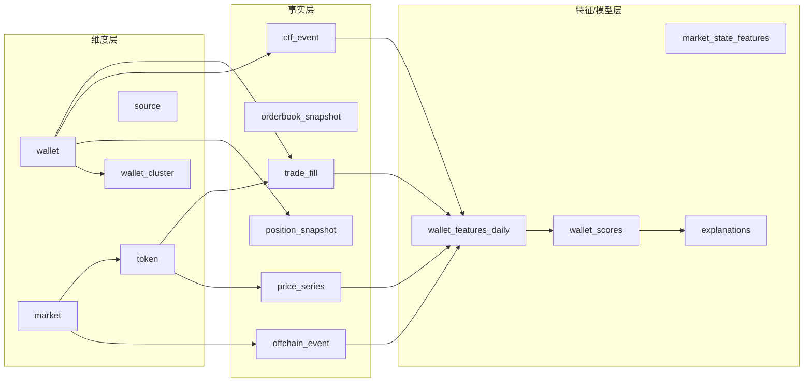

# Polymarket 聪明钱包分析产品：深度分析与产品规划报告

## 执行摘要

本报告面向“跟踪 Polymarket 上赚钱的钱包（地址/账户）并解释其盈利来源”的产品目标，给出一套可落地的数据与模型方案，以及基于 Next.js + Tailwind CSS（前端）与 Gin + GORM + Postgres + Viper + Zap（后端）的工程化架构设计。报告结论如下：

Polymarket 的“可观测面”足以支撑高质量的钱包画像与策略归因，但必须接受一个现实：**“内幕交易”无法被链上数据直接证明，只能以统计证据与行为模式给出概率性判断，并且需要严格的误报控制与合规披露**。Polymarket 采用“链下撮合、链上结算”的混合 CLOB 结构，订单为 EIP-712 签名消息，撮合成交在 Polygon 原子结算；同时其市场头寸由 Gnosis 的 Conditional Token Framework（CTF）以 ERC-1155 形式上链，分拆/合并/赎回等头寸操作也在链上发生。citeturn2view2turn2view5turn2view3turn3view3

因此，建议采用“三层归因框架”作为产品核心：

- **第一层：绩效事实（Facts）**——用统一口径计算胜率、回报率、PNL、资金周转与风险暴露，并拆分来源（交易赚、做市返佣、跨市场对冲/套利、费用/滑点影响等）。Polymarket 提供 Data API（用户交易/持仓/排行榜等）与多套 Goldsky 托管的 subgraph（Positions/Orders/Activity/Open Interest/PNL），可用于构建稳定口径。citeturn2view0turn2view1  
- **第二层：策略类型（Strategy）**——聚类/规则/弱监督结合，将“做市型、事件型、统计型、套利对冲型、短线噪声型、一次性好运型”等分群，并给出可解释证据（指标对比、典型交易片段、时序图）。  
- **第三层：信息优势（Information Edge）**——对每笔交易评估其“信息时点优势”（相对新闻/社交媒体/官方公告/链上事件的提前量），再对钱包聚合成“信息优势评分”。在金融研究中，公开但难处理的信息会在“成为常识（common knowledge）”之前被少数参与者更快利用；这类“处理能力优势”与“内幕”在行为上相似，必须在产品叙述中明确区分。citeturn11view1turn9view3

工程落地上，建议 MVP 先做“**可复现的 PNL 口径 + 钱包分群 + 可解释画像**”，再逐步叠加“信息事件时间线、反事实检验、告警/订阅、实时流处理”。Polymarket 已公开 Gamma/Data/CLOB 三套 API 与桥接 API，且其合约地址（Polygon 主网、chainId=137）官方给出“单一真相源”；这使得数据采集可控、可审计、可回放。citeturn2view0turn3view0turn7view0

合规与风险方面：Polymarket 曾与美国监管机构发生执法与和解（包含民事罚款、停止/整改等要求），近年又出现州级监管争议；在加拿大也存在证券监管层面的文件与限制。产品若涉及“内幕”标签、去匿名化或身份指认，容易触发声誉与法律风险，应采用“**不指名道姓、不输出个人身份 PII、只做概率与不确定性披露**”的策略，并提供用户投诉与纠错流程。citeturn9view1turn0search10turn9view0turn0news40

---

## 背景与问题定义

### Polymarket 的交易与头寸机制对“聪明钱包分析”的影响

Polymarket 交易系统为混合式 CLOB：链下撮合、链上通过 Exchange 合约结算；订单是 EIP-712 签名消息，撮合成交在 Polygon 上进行原子结算，且用户可链上独立撤单，Exchange 合约由审计机构审计。citeturn2view2turn2view4turn3view3

这意味着“聪明钱包分析”需要同时覆盖三类行为：

- **CLOB 交易行为**：下单/成交/撤单、挂单深度、价差、滑点、成交节奏等（主要来自 CLOB API + Orders subgraph + Data API）。citeturn2view0turn2view1  
- **CTF 头寸行为**：分拆（split）、合并（merge）、赎回（redeem）以及 ERC-1155 余额变化（主要来自 Activity/Positions subgraph 与链上日志）。citeturn2view5turn2view1turn2view3  
- **资金进出与账户形态**：桥接入金、USDC/USDC.e 转换、代理/安全钱包等账户结构（Bridge API + 合约工厂事件 + 资金流追踪）。citeturn7view0turn3view0turn2view2

Polymarket 官方列出关键合约地址（Polygon 主网 chainId=137），包括 CTF Exchange、Conditional Tokens、代理/安全钱包工厂、UMΑ 相关解算合约、以及用于 USDC.e ↔ USDC 兑换的 Uniswap v3 池等，这对“地址归因、合约交互特征、资金路由”极关键。citeturn3view0

### 费用与“交易成本模式”是策略识别的重要信号

Polymarket 大多数市场无交易费，但部分市场启用 taker fee 用于做市返佣（rebates），并给出费用计算公式与不同市场类型的参数；同时存在“Relayer/Builder”机制可为用户提供免 gas 的链上操作（由平台基础设施代付 gas），这会显著改变“gas/费用模式”特征，必须纳入模型口径。citeturn6view1turn6view0

### 合规与市场环境的不确定性

Polymarket 在美国曾被监管机构认定涉及未注册的事件类合约交易设施并产生和解/处罚；公开文件显示民事罚款金额与整改要求。citeturn9view1turn0search2  
此外，公开报道显示其在部分司法辖区存在持续的监管争议与限制；加拿大证券监管文件亦提及其运营实体与地区限制。citeturn0search10turn9view0turn0news40

这些背景决定了：**产品需要把“数据分析/研究工具”与“指控/定罪式表述”严格隔离**，同时在功能与文案中内置审慎披露。

### 假设与未指定项

- 预算：未指定（建议 MVP 以“低成本可迭代”为原则，优先用官方 API + subgraph，减少自建全量链上索引）。  
- 团队规模：未指定（工时估算将以“1 名全栈 + 1 名数据/算法”为基准，并给出拆分建议）。  
- 上线时间：未指定（建议 MVP 4–6 周可交付，若要求实时与复杂归因，通常需要 8–12 周）。  
- 实时监控要求：未指定（建议 MVP 先做 5–15 分钟级准实时，后续再做 WebSocket + 流处理）。  

---

## 现有“聪明钱包/聪明地址”分类综述

本节将“聪明钱包”分类方法分为两大谱系：**行业产品/标签体系**与**学术研究/可复现实验方法**。二者差异在于：行业更强调可用性与运营标签，学术更强调可解释与可验证的判定规则。

### 行业主流分类框架：标签化、绩效化与场景化

#### entity["company","Nansen","onchain analytics"]：Smart Money（分群 + 绩效阈值 + 动态更新）

Nansen 给出“Smart Money”的两类定义：其一是“机构/基金/影响力鲸鱼”（需要链上与链下联合识别），其二是“链上某类活动的顶尖表现者”（按活动分群并以 PnL/ROI/胜率/多样性等指标排名，标签动态更新）。citeturn4view1turn4view2  
其历史文章还展示了更细的 Smart Money 分段（如早期 LP/质押、基金与私募投资者、空投型、NFT 交易型等），并阐明这些标签背后的行为假设与使用方式。citeturn4view0

对 Polymarket 产品的启示：  
- “按活动分群”可迁移为“按预测市场活动分群”（做市/事件/对冲/套利/长线组合等）。  
- “动态榜单”可迁移为 7D/30D/90D 多窗口表现标签，降低一次性好运误判。citeturn4view2

#### entity["company","Arkham","blockchain intelligence"]：实体归因与去匿名化导向的情报平台

Arkham 提供 API 文档，数据模型强调 Address / Entity / Label，并包含“How Arkham Labels Wallets”等条目与速率/计费信息，属于典型“实体情报”路线。citeturn5search1  
其公开“Intel Exchange”准则强调仅允许基于公开可验证数据的情报，禁止请求/提交个人敏感信息（PII），并对“个人归因”设置“公共利益”门槛，这对你的产品伦理设计具有直接参考价值。citeturn5search5  
其白皮书也明确把“系统化去匿名化”作为平台方向之一。citeturn11view2

对 Polymarket 产品的启示：  
- “实体归因”极吸引用户，但风险巨大；建议把“身份归因”作为高门槛、以组织为主、可申诉可纠错的能力，而不是默认功能。

#### entity["company","0xScope","web3 data platform"]（Scopescan）：以近 30 天表现为核心的 Smart Money v2

0xScope 公开介绍其 Smart Money v2：以最近 30 天 Top 地址为主，并使用 ROI、Profit、Win Rate、Investment Diversity 等综合指标定义“最佳表现”。citeturn5search2  
这类“滚动窗口 + 综合评分”方法对预测市场尤其合适，因为事件市场强非平稳（热点更替快），长期 PnL 容易被少数大事件主导。

#### entity["company","DeBank","web3 portfolio tracker"]：以资产/协议持仓聚合为核心的数据服务

DeBank Cloud 提供 Open API 与数据模型文档（用户资产、链列表、协议仓位等），更偏“全链资产画像”与“协议交互画像”。citeturn5search3turn5search11turn5search15  
对 Polymarket 产品的启示：  
- 你可以用 DeBank（或同类）补足“该地址在预测市场之外的行为”：是否是专业交易地址、是否频繁与交易所/桥/MEV 合约交互，从而减少误判。

#### entity["company","Dune","blockchain analytics platform"]：面向研究与仪表盘的 SQL 数据仓库范式

Dune 提供数据查询与引擎文档，强调用 SQL 在其链上数据表上做分析与可视化。citeturn5search0turn5search4  
对 Polymarket 产品的启示：  
- Dune 适合做“公开可复现的研究仪表盘/社区验证”，但不一定适合做你要的“实时智能钱包画像产品”（除非购买其低延迟 API/数据导出能力）。

### 学术与可复现方法：聚类、机器人识别、信息优势与市场微观结构

#### 账户聚类与实体识别：Ethereum 地址聚类启发

经典工作指出，以启发式规则对以太坊地址进行聚类可得到更接近“实体”的分析单位，并提出多种可直接用于账户模型链（而非 UTXO）的聚类启发式。citeturn9view2  
对 Polymarket 产品的启示：  
- Polymarket 有代理钱包/安全钱包工厂与 relayer 等机制，“一个人多个地址/多个合约钱包”很常见；若不做聚类，会把同一实体拆成多个钱包，降低画像质量。citeturn3view0turn6view0

#### 机器人/自动化交易识别：基于时间、频率与 gas 特征的可解释模型

针对以太坊金融机器人识别的研究表明：交易的时间分布、频率、gas price、gas limit 等特征对分类非常重要，并可用可解释方法（如 SHAP）分析特征贡献，同时还能细分 MEV 相关机器人类别。citeturn17view1  
对 Polymarket 产品的启示：  
- 预测市场存在做市机器人与套利脚本；自动化程度本身就是“聪明钱包”重要维度（但不是等同于信息优势）。

#### MEV/交易排序优势：可作为“成本优势/执行优势”维度纳入画像

监管与研究机构解释了“MEV（最大/矿工可提取价值）”如何源于交易排序权带来的前跑/夹子等行为，并指出这类机制可能导致操纵与市场不公平。citeturn11view0turn17view2  
针对 Polygon 的研究也分析了该网络上的 MEV 形态（如原子套利、spam-based 与 auction-based backrunning），这类“执行优势”会反映在 gas/提交策略上。citeturn17view0turn17view1  
对 Polymarket 产品的启示：  
- 即使 Polymarket 是 CLOB，相关资金仍在 Polygon 上流动，且用户可能通过其他协议对冲/套利；因此“MEV/套利行为”应作为外部特征之一。

#### 预测市场价格的含义：价格可近似为群体信念但可能有偏

预测市场研究指出，在一定条件下，预测市场价格通常接近交易者信念的均值，并可作为事件发生概率的有用（但有时带偏）估计。citeturn13view0  
对 Polymarket 产品的启示：  
- 你可以用“入场价格（隐含概率）+ 事件结果”来构建“是否买到低估/高估”的统计检验，从而区分运气与持续优势。

#### “真金白银 vs 模拟币”对信息发现与聚合的影响：激励结构可影响优势来源

对预测市场的实验研究比较真实货币与模拟货币市场，发现二者在某些场景下预测表现可能相近，并推测真实货币更可能激励信息发现，而模拟货币可能更利于高质量意见权重形成。citeturn16view0  
对 Polymarket 产品的启示：  
- 当你解释“聪明钱包优势”时，可把优势分解为“信息发现/获取优势”“信息处理优势”“执行优势”“风险管理优势”，避免把所有超额收益都归因于内幕。

### 汇总表：可迁移到 Polymarket 的“聪明钱包”分类与判定线索

| 类别（面向产品） | 定义（产品口径） | 判定特征（可量化） | 优点 | 缺点/风险 | 代表性来源/工具 |
|---|---|---|---|---|---|
| 绩效型 Top Traders | 滚动窗口内 PnL/ROI/胜率等综合靠前的钱包 | 7D/30D/90D PnL、ROI、交易次数、市场覆盖度、回撤等 | 对用户直观、易排序；适合榜单 | 容易把“好运/单一事件”误判为能力，需要显著性检验 | Nansen Smart Money 方法论citeturn4view1turn4view2；0xScope Smart Money v2citeturn5search2 |
| 机构/实体归因型 | 钱包属于已知组织/团队/交易主体 | 标签/公开披露/对手方关系/资金聚合路径 | 解释力强（“谁在买”） | 去匿名化与名誉风险高；需要申诉与证据链 | Arkham API 与准则citeturn5search1turn5search5 |
| 行为分群型（策略型） | 通过交易行为聚类得到的策略群体（做市/事件/套利/对冲/长线） | 挂单率、价差、库存周转、持仓时长、对冲比例、跨市场相关性 | 可解释且可迁移到预测市场专用 taxonomy | 需要高质量特征工程；冷启动难 | Nansen 分群思路（按活动分段）citeturn4view0turn4view1；Dune 研究范式citeturn5search0 |
| 自动化/机器人型 | 以脚本自动执行、对时延敏感的地址 | 交易时间熵、频率、gas/提交模式、批量交易特征 | 可识别做市/套利脚本；适合告警 | 容易误伤高频人工；gasless 会掩盖 gas 特征 | 机器人识别研究citeturn17view1；MEV taxonomiesciteturn11view0turn17view2 |
| 多地址实体聚类型 | 将代理/关联地址聚合为“实体” | 工厂合约创建、同 owner、多重签名、资金源/去向一致性 | 提升画像准确性（减少拆分） | 聚类可能引入误合并；需要置信度与可回溯 | 地址聚类启发式citeturn9view2turn3view0 |
| 外部画像补全型 | 用跨链资产与协议交互补足钱包特征 | 持仓结构、链分布、与 CEX/桥/DeFi 协议交互 | 降误判；支持“职业交易者”识别 | 第三方数据成本与合规约束 | DeBank Open APIciteturn5search3turn5search11 |

---

## Polymarket 与类似预测市场中盈利钱包的交易特征分析

本节给出可量化指标体系，并给出“运气/统计策略/信息优势/内幕嫌疑”等归因方法。这里的关键原则是：**先把 PnL 口径做成“可复现的会计系统”，再做策略解释**。

### 基础：头寸与收益的会计口径

Polymarket 的头寸由“Yes/No”两类 outcome token 表示，均为 ERC-1155；交易即买卖这些 token；分拆/合并/赎回是与 CTF 合约交互的核心操作。citeturn2view5turn2view3  
因此钱包收益至少分三块：

1) **交易收益（Trading PnL）**  
- 买入 Yes 价格 p，若最终结果为 Yes，则每份 token 兑现 1；若为 No 则兑现 0。  
- 简化到“单份 token”层面，忽略费用时：买入的结果收益 = outcome − p；卖出则相反。  
2) **做市相关收益（Maker rebates / spread capture）**  
- 在启用 taker fee 的市场类型中，收取的费用会按规则返还给做市者；此外做市者也可能通过吃价差与库存管理获利。citeturn6view1  
3) **资金成本与执行成本（fees / gas / bridge slippage）**  
- 包括 taker fee、桥接滑点、链上 gas；但由于存在 relayer 代付 gas 的“gasless 交易”，gas 模式必须与钱包类型/访问方式联合判断。citeturn6view0turn7view0

建议你的产品在“收益分解”上采用以下口径（从 MVP 就做对）：

- **Realized PnL（已实现）**：平仓/赎回后落袋的收益。  
- **Unrealized PnL（未实现）**：按当前 mid price 估值的浮盈浮亏（需可回放价格来源）。  
- **Fee & Cost Attribution（费用归因）**：taker fee、桥接损耗、gas（若可观测）。  
- **Event-level PnL（按市场/事件归因）**：识别“一个大事件赚了全部钱”的钱包 vs 分散稳定赚钱的钱包。

Polymarket 官方提供 PNL subgraph 与 Data API（包含用户 trades、positions、leaderboards 等）为实现以上口径提供了直接数据基础。citeturn2view0turn2view1

### 指标体系：用于“赚钱钱包画像”的可量化指标

下表给出建议的“钱包级指标”，并标注数据来源与判别价值（可从第一天开始埋点）。

| 指标族 | 指标（示例） | 计算要点 | 价值（对应推断） | 主要数据源 |
|---|---|---|---|---|
| 绩效 | 胜率（win rate）、平均边际收益（avg edge）、ROI、PNL、最大回撤 | 胜率需定义“按单/按事件/按资金加权”；ROI 要明确成本基准（投入 USDC.e） | 区分“长期赚钱”与“偶然爆赚” | Data API、PNL subgraphciteturn2view0turn2view1 |
| 持仓行为 | 平均持仓时长、入场到平仓的分布、提前赎回/对冲比例 | 需对部分平仓与滚动持仓做拆分 | 区分“事件前短线”与“长期持有/价值型” | Orders/Activity/Positions subgraphciteturn2view1 |
| 下单时点 | 下单/成交时间相对信息事件（Δt）、信息事件前的仓位变化速度 | 信息事件需构建链下时间线 | 区分“信息优势（提前）”与“追涨杀跌” | CLOB API、Orders subgraph + 新闻/社媒citeturn2view0turn2view1turn11view1 |
| 资金流 | 入金速度、单次入金金额、资金来源链与桥接路径 | 大额桥接可能有滑点/路径特征 | 区分“专业资金/机构”与“散户”；识别资金调度能力 | Bridge API + 链上转账citeturn7view0 |
| 做市特征 | 挂单占比、订单取消率、平均价差、库存周转、是否参与 fee 市场 | 需要 orderbook/订单事件数据 | 识别 market maker / liquidity provision 行为 | CLOB API + Orders subgraphciteturn2view0turn2view1 |
| 套利/对冲 | 同事件 Yes/No 双边持仓、跨事件相关性对冲、跨平台价格差套利频率 | 需要跨市场映射与资金流 | 区分“低风险套利/对冲型”与“单边赌博” | Trades + 市场数据 + 外部赔率/交易所 |
| 执行与自动化 | 交易时间熵、频率、批量操作、gas 模式、是否使用 relayer | gasless 会改变 gas 观测 | 识别机器人/脚本与执行优势 | 链上 tx + 机器人特征研究方法citeturn17view1turn6view0 |
| 关联与实体 | 代理/安全钱包比例、同 owner/同资金源地址簇 | 需要工厂/owner 解析与聚类置信度 | 把“人”作为单位，而非单地址 | 合约地址与工厂citeturn3view0turn9view2 |

### 如何判定“内幕/信息优势/统计策略/运气”：可操作的证据框架

这里给出一个“**可在产品中解释**”的四分法，并明确证据强弱与误报风险。

#### 运气型（Luck-driven）

典型表现：  
- 交易样本量小（例如只参与少数事件），但 PnL 巨大；收益高度集中在 1–2 个事件；缺乏跨时间窗口的稳定性。  
- 若用入场价格隐含概率作为基准，胜率/边际收益在统计上不显著（p 值不够小，或置信区间覆盖 0）。

可执行检验（建议 MVP 就做）：  
- **稳定性检验**：把钱包表现按 7D/30D/90D 滚动窗口计算，若只有单窗口异常高，其余接近随机，则倾向运气。行业产品也采用多时间窗标签以应对短期波动。citeturn4view2turn5search2  
- **事件集中度（Herfindahl/Top-K share）**：Top-1/Top-3 事件贡献占比过高 → 运气或单一信息源。  
- **反事实置换检验**：保持钱包的交易规模与交易次数不变，将其交易“随机映射到同期限的其他市场价格序列”，产生 PnL 分布；若真实 PnL 并不极端，则更像运气（实现细节见后文“反事实检验”）。

#### 统计策略型（Quant / analytical）

典型表现：  
- 覆盖市场多、分散度高；单个事件投入较小但长期稳定赚钱；平均胜率未必极高，但“买入边际收益（outcome − p）”长期为正。  
- 更偏“低波动、低回撤、较高信息比率”，而不是“押注爆点”。  
- 常见于对特定类别（如体育、加密短周期市场）做模型化定价，并在价格偏离时入场。

可执行证据：  
- **跨市场分散与一致性**：多个类别都能维持正 edge。  
- **对价格偏离敏感**：在赔率/价格快速偏离后更倾向“逆向入场+止盈”，而不是追涨。  
- **费用敏感性**：在启用 taker fee 的市场中仍能保持正 edge，说明策略考虑成本；而费用结构在 50% 概率附近最贵等细节会影响交易分布。citeturn6view1

#### 信息优势型（Information processing edge / speed edge）

必须强调：这不等同内幕。金融研究指出，即使信息在技术上是公开的，**处理成本差异**也会导致少数参与者先交易、价格先反应，而后才通过社交媒体等渠道扩散成“常识”。citeturn11view1turn9view3  

典型表现：  
- 在“信息事件”前显著提前建仓，且时间窗口稳定（例如总是提前 30–90 分钟）；建仓后价格很快朝其方向移动；成交规模与“提前量”正相关。  
- 高度依赖“数据处理/监控能力”：例如监控链上解算流程、监控某些官方数据发布、或监控特定新闻源的结构化信息。

可执行证据：  
- **事件研究（Event Study）**：以特定信息事件（公告、重大新闻、赔率跳变、预言机提案等）为 t=0，观察钱包在 t<0 的净买入与其后价格变动。  
- **Δt 分布显著偏负**：钱包的“首次建仓时间 − 事件时间”分布显著早于同市场普通用户。  
- **“公开但非显然”信息的优势**：类似研究用“链上记录时间 vs 社交媒体披露时间”区分公开信息与常识时间，你可用“官方数据源更新时间 vs 社媒热度爆发”做类比。citeturn11view1

#### 内幕嫌疑型（Insider-suspected）

必须采取极审慎措辞：链上分析只能给出“嫌疑/异常”，不能给出“内幕事实”。该标签应是**最高风险等级**，默认不面向公众开放，或只对内部风控/研究用户开放。

可疑模式（需要多证据叠加才提示）：  
- **高度聚焦**：持续只交易某一小圈子事件（地域性、行业性很强），并在关键节点前精准进出。  
- **信息窗口极窄且收益极高**：总是在“不可合理获得的窄窗口”内建仓，并在极短时间内获利；且这种模式可重复出现。  
- **资金与对手关系异常**：与特定地址簇存在稳定资金往来（例如某些组织钱包或内部结算钱包），或同一实体多地址协同推/拉盘口（需实体聚类与对手方分析）。citeturn9view2  

建议产品输出形式：  
- 给出“异常证据清单 + 置信度 + 误报提示 + 数据可回放链接”，而不是一句“内幕”。

---

## 可用数据源与采集方法

本节按“优先级”列出数据源，并说明字段、频率、限制、成本与合规注意点。总体策略是：**优先用 Polymarket 官方 API + 官方 subgraph；再用链上 RPC/浏览器 API 补齐；最后才是昂贵或合规模糊的链下数据与去匿名化数据**。

### 采集优先级总览

| 优先级 | 数据源 | 可获得的关键字段（示例） | 频率/延迟 | 主要限制与成本 | 合规/隐私注意点 |
|---|---|---|---|---|---|
| P0 | Polymarket Gamma API | 市场与事件元数据、标签、series、comments、公共 profile | 公共 API；可定时拉取 | 需处理分页与变更；字段随版本可能变动 | 遵守 ToS；缓存与速率控制 |
| P0 | Polymarket Data API | 用户 positions、trades、activity、leaderboards、open interest 等 | 公共 API；适合 5–15 分钟拉取或更频繁 | 依赖官方稳定性；需做幂等与补拉 | 避免把“排行榜”当作身份指认 |
| P0 | Polymarket CLOB API | orderbook、midpoints、spreads、price history；部分端点需认证（交易） | 公共行情可高频；下单端点需 auth | 高频调用需缓存；行情请求量大 | 不要诱导用户绕过交易权限 |
| P0 | Polymarket Subgraphs（Goldsky） | Positions/Orders/Activity/Open Interest/PNL 等 GraphQL 实体 | 近实时索引；可按 block/时间查询 | 端点可能被滥用；需限流与缓存 | 数据公开但仍需避免输出 PII |
| P1 | 链上 RPC（节点服务） | tx、logs、合约事件、内部调用（视 provider 能力） | 可实时订阅新块 | 计费与速率限制（compute units/credits） | 不采集 IP/指纹等非必要数据 |
| P1 | 区块浏览器 API | 交易列表、日志查询、合约验证信息 | 通常秒级 | 免费层速率限制明显 | 需遵守 attribution/条款 |
| P2 | MEV/交易排序监测 | 夹子/前跑/回跑识别、原子套利标注 | 研究级或第三方服务 | 构建成本高；误报多 | 避免把“MEV”直接等同恶意 |
| P2 | 链下新闻/社交媒体时间线 | 新闻发布时刻、社媒热度爆点、关键字事件 | 取决于数据源 | 成本与授权差异大 | 涉及用户数据要谨慎，尽量用公开媒体 |

以上三套 Polymarket API 的官方“Introduction”页面给出了端点域名与职责分工：Gamma（市场发现与元数据）、Data（用户与统计数据）、CLOB（订单簿与交易操作），另有桥接 API。citeturn2view0  
Polymarket subgraph 页面列出可用 subgraph 类型、实体查询（如 orderFilledEvents、splits/merges/redemptions 等），并说明由 entity["company","Goldsky","subgraph hosting"] 托管。citeturn2view1

### Polymarket 官方数据：字段要点与采集策略

#### Gamma/Data/CLOB API

- Gamma API 与 Data API 为“完全公开、无需认证”，适合做市场列表、市场状态、用户排行、用户交易历史的主干数据。citeturn2view0turn0search34  
- CLOB API 提供 orderbook、midpoints、spreads、price history 等行情与订单簿数据；交易/撤单等需要两级认证（L1 签名派生 L2 凭证，L2 HMAC 头用于交易请求）。即便你不做交易，也要理解认证模型以解释某些“订单行为缺失/只看到成交”的现象。citeturn2view2turn0search26  
- 另外存在 WebSocket Channel（Market/User/Sports），适合做准实时行情与活动流（若 MVP 需要）。citeturn2view0

#### Subgraph（GraphQL，Goldsky）

官方 subgraph “Schema Reference”列出了 Positions（userBalances 等）、Orders（orderFilledEvents、ordersMatchedEvents、orderbooks）、Activity（splits/merges/redemptions 等）与 PNL 等实体集合，这使得你可以在不自建索引的情况下完成大部分“链上事实”查询。citeturn2view1

建议采集策略：  
- **冷数据（历史）**：用 subgraph 分页拉全量 trades/CTF events（可按 block 范围、时间范围切片），落地到 Postgres 分区表。  
- **热数据（近实时）**：对新增 block/最新时间窗口做增量拉取，必要时用 WebSocket 推送补齐。  
- **一致性**：以 tx_hash + log_index（或 equivalent）做去重键；对 reorg 风险设“确认深度”（例如 50–200 个块，视 Polygon 特性调参）。

### 链上数据与节点服务：成本与限制

#### entity["company","Alchemy","blockchain node provider"]

Alchemy 的计费与限流以 Compute Units（CUs）与吞吐（CUs per second）为核心概念，文档明确说明 throughput compute units 的意义与限流方式。citeturn18search0turn18search8turn18search12  
对你的产品建议：  
- 大规模日志拉取（eth_getLogs）应做“按块区间切片 + 并发受控 + 缓存”，否则很容易触发吞吐限制。  
- 关键路径（准实时）建议单独配置专用 app 与专用 key，避免后台批处理挤占实时额度。

#### entity["company","Infura","blockchain infrastructure"]

Infura 的官方定价/文档用 credits/day 与 credits/sec 表达额度（不同入口页面可能展示不同口径），并给出免费与付费层级示例。citeturn18search1turn18search19turn18search5  
对你的产品建议：  
- 若采用 Infura，务必在配置中抽象“provider adapter”，以便未来在 Alchemy/Infura/自建节点之间切换。

#### entity["company","Etherscan","blockchain explorer"] 与 entity["organization","PolygonScan","polygon explorer api"]

Etherscan 官方文档列出不同 API plan 的 rate limit；Polygonscan 信息中心也给出免费 API 的调用频率与每日上限示例。citeturn18search3turn18search2  
对你的产品建议：  
- 区块浏览器 API 适合做“合约 ABI、验证信息、辅助查询”，不适合作为高频实时主数据源；尤其当你已经使用 subgraph/RPC 时。

### 交易池/MEV 监测与外部行为补足

- MEV 的概念、分类与风险可参考监管/研究机构与 Flashbots 的 taxonomy 讨论。citeturn11view0turn17view2  
- 针对 Polygon 的 MEV 研究显示该网络上存在不同 backrunning 策略与盈利差异，说明“执行层优势”在 Polygon 生态真实存在。citeturn17view0  
- 若要把 MEV 作为“外部画像”，可先做轻量版本：识别钱包是否频繁与 DEX 路由/套利合约交互、交易节奏是否高度脚本化（参考机器人识别中的时间/频率/gas 特征）。citeturn17view1

### 链下新闻/社交媒体时间线：用于“信息优势”判定的关键

构建链下时间线的目的不是做舆情，而是给“信息事件”一个可比较的 t=0。研究表明“公开链上信息”与“常识化传播”之间存在时间差，且价格发现可能在公告前已发生。citeturn11view1turn9view3  
建议 MVP 先选低成本来源：  
- 官方数据发布（例如政府统计、赛程/比分官方源）  
- 主流媒体 RSS（只取标题与发布时间）  
- X/平台趋势（只取“爆点时刻”，不存储用户画像）

---

## 数据处理与分析方法

本节给出数据模型（ER）、关键特征工程、异常检测、因果/时间序列分析、聚类/分类与反事实检验方法，并给出数据库表结构示例（字段、类型、索引建议、示例数据）。

### 建议的数据模型（ER 关系）

核心思想：把数据拆为“事实表（trades/events/price）”与“维度表（wallet/market/token）”，再在此基础上生成“特征表（features）”与“评分表（scores）”。



说明：  
- trade_fill 是最重要的事实表（成交），ctf_event 用于识别 split/merge/redeem 等头寸操作。citeturn2view1turn2view5  
- offchain_event 用于做事件研究与信息优势 Δt 计算。citeturn11view1  
- wallet_cluster 用于将代理钱包/多地址实体合并（置信度可回溯）。citeturn9view2turn3view0

### 数据表结构示例（Postgres）

下面给出 MVP 必须的 6 张表（实际可扩展到 12–20 张）。示例数据仅为格式演示。

#### 表：wallet

| 字段 | 类型 | 约束/索引建议 | 示例 |
|---|---|---|---|
| id | bigserial | PK | 1001 |
| address | bytea | UNIQUE(btree)；存 20 bytes | `\x12ab...` |
| chain_id | int | INDEX(btree) | 137 |
| wallet_kind | smallint | INDEX(btree)（0=EOA,1=Proxy,2=Safe,9=Unknown） | 2 |
| first_seen_at | timestamptz | INDEX(btree) | 2025-11-01T00:00:00Z |
| last_seen_at | timestamptz | INDEX(btree) | 2026-02-20T01:02:03Z |
| cluster_id | bigint | INDEX(btree) | 300 |

“wallet_kind”的判定可基于官方工厂合约地址（Safe/Proxy 工厂）与创建事件；这些地址在 Polymarket 合约清单中给出。citeturn3view0turn2view2

#### 表：market

| 字段 | 类型 | 约束/索引建议 | 示例 |
|---|---|---|---|
| id | bigserial | PK | 20001 |
| polymarket_market_id | text | UNIQUE | `123456` |
| question | text | GIN(trgm) 可选 | `Will X happen by ...?` |
| category | text | INDEX | `Politics` |
| status | smallint | INDEX (0=active,1=closed,2=resolved) | 0 |
| open_time | timestamptz | INDEX | ... |
| close_time | timestamptz | INDEX | ... |
| resolution_time | timestamptz | INDEX | ... |
| resolved_outcome | smallint | 0/1/NULL | NULL |

市场发现与元数据主要来自 Gamma API。citeturn2view0

#### 表：token

| 字段 | 类型 | 约束/索引建议 | 示例 |
|---|---|---|---|
| id | bigserial | PK | 50001 |
| market_id | bigint | FK + INDEX | 20001 |
| token_id | bigint | UNIQUE（Polymarket token_id） | 123456789 |
| side | smallint | INDEX (1=YES,0=NO) | 1 |
| decimals | smallint | | 0 |

token_id 与 condition/position 映射可从 subgraph（tokenIdConditions 等）获取。citeturn2view1turn2view3

#### 表：trade_fill（成交事实）

| 字段 | 类型 | 约束/索引建议 | 示例 |
|---|---|---|---|
| id | bigserial | PK | 90001 |
| token_id | bigint | INDEX | 123456789 |
| maker_wallet_id | bigint | INDEX | 1001 |
| taker_wallet_id | bigint | INDEX | 1002 |
| side | smallint | INDEX (buy/sell from taker perspective) | 1 |
| price | numeric(18,8) | | 0.63 |
| size | numeric(36,18) | | 250 |
| fee_paid | numeric(18,8) | | 0.12 |
| tx_hash | bytea | INDEX | `\xabcd...` |
| block_number | bigint | INDEX | 60329345 |
| block_time | timestamptz | INDEX | 2026-02-20T00:01:02Z |
| source | smallint | INDEX (0=subgraph,1=data_api) | 0 |
| uniq_key | text | UNIQUE（tx_hash+log_index 或 fill_id） | `...` |

Orders subgraph 提供订单撮合与成交事件实体；Data API 也提供用户 trades 类数据，可做交叉校验。citeturn2view1turn2view0

#### 表：ctf_event（split/merge/redeem）

| 字段 | 类型 | 约束/索引建议 | 示例 |
|---|---|---|---|
| id | bigserial | PK | 80001 |
| wallet_id | bigint | INDEX | 1001 |
| market_id | bigint | INDEX | 20001 |
| event_type | smallint | INDEX (1=split,2=merge,3=redeem,4=transfer) | 1 |
| usdc_amount | numeric(18,8) | | 1000 |
| tx_hash | bytea | INDEX | ... |
| block_number | bigint | INDEX | ... |
| block_time | timestamptz | INDEX | ... |

CTF 的核心操作（split/merge/redeem）是头寸机制基础，且由 Activity subgraph 与 CTF 合约事件体现。citeturn2view3turn2view5turn2view1

#### 表：offchain_event（链下信息事件）

| 字段 | 类型 | 约束/索引建议 | 示例 |
|---|---|---|---|
| id | bigserial | PK | 70001 |
| market_id | bigint | INDEX | 20001 |
| event_time | timestamptz | INDEX | 2026-02-19T12:00:00Z |
| event_type | text | INDEX | `breaking_news` |
| source_name | text | | `reuters_rss` |
| payload | jsonb | GIN(jsonb_path_ops) | `{ "title": "...", "url": "..." }` |

offchain_event 的时间戳用于计算“钱包建仓提前量 Δt”，从而构建信息优势证据链。citeturn11view1turn13view0

### 关键特征工程

建议把特征分为 5 类（并在 wallet_features_daily 表中落地，便于回测与可解释性）：

1) **绩效与风险（Performance/Risk）**  
- pnl_7d / pnl_30d / pnl_90d  
- roi_30d（投入资金口径要固定：sum(abs(cash_outflow)) 或平均占用资金）  
- max_drawdown_90d  
- event_concentration_top1 / top3

2) **交易风格（Style）**  
- avg_hold_time, median_hold_time  
- trade_count, active_days  
- maker_ratio（成交中 maker 身份占比）  
- order_cancel_ratio（如可得）

3) **信息时点（Timing/Edge）**  
- mean_pre_event_delta（相对 offchain_event 的提前量，负数代表提前）  
- early_entry_rate（在事件前 X 分钟内建仓的比例）  
- price_impact_proxy（建仓后短期价格变化幅度）

4) **做市/库存（MM/Inventory）**  
- spread_capture_proxy（在 fee 市场/高流动市场的价差收益代理）  
- inventory_turnover（持仓周转）  
- split_merge_frequency（做市常需要 split/merge 以构建库存）citeturn2view5turn6view1

5) **自动化/执行（Automation/Execution）**  
- tx_time_entropy（交易小时分布熵）  
- tx_frequency（单位时间交易密度）  
- gas_pattern_features（若非 gasless）  
机器人识别研究指出时间/频率/gas 类特征对分类很关键。citeturn17view1

### 异常检测与分群/分类模型建议

#### 异常检测（用于“内幕嫌疑/可疑行为”而非定罪）

- **基于分布的异常**：Isolation Forest / Robust Z-score（对“超大单、超短提前量、超集中事件收益”等特征）。  
- **时序突变检测**：CUSUM / Bayesian Change Point（检测钱包行为突然改变：从分散→高度集中，或交易频率突增）。  
- **图异常**：基于地址簇的资金流图（in/out degree、循环流、同簇协同建仓），但输出必须是“异常提示”而非身份指控。citeturn9view2

#### 聚类（用于策略类型）

- 先做标准化与去极值（winsorize），用 HDBSCAN/谱聚类把钱包分成 6–10 类，再用可解释规则命名（做市型/事件型/统计型等）。  
- 聚类结果应输出“原型钱包特征”与“群内代表交易片段”，以支持产品解释。

#### 监督分类（用于可解释标签）

当你积累到足够“人工标注样本”（例如内部研究团队标注 200–500 个钱包），可训练多分类模型：  
- 模型：LightGBM / XGBoost / 逻辑回归（可解释优先）  
- 解释：SHAP（参考机器人识别研究对特征解释的做法）citeturn17view1

### 因果推断与反事实检验：把“看起来像内幕”变成“可证伪的假设”

你可以把“内幕/信息优势”转化为可检验假设：

- **假设 H1（信息优势）**：钱包的盈利主要来自“信息事件前的提前建仓”，且该提前量在多个事件中可重复。  
- **反事实构造**：  
  - 时间置换：保持同样交易次数与规模，将交易时间随机平移到控制窗口，计算 PnL 分布；  
  - 市场置换：在同类别市场中随机替换 token_id 的价格序列，保持交易时间不变；  
- **显著性**：以 bootstrap 产生 p 值与置信区间；输出到产品侧的不是 p 值本身，而是“置信等级（高/中/低）+ 可回放证据”。

这里借鉴的核心思想是：**价格在公开信息成为常识前就可能发生显著发现**，因此必须用“事件时间线 + 反事实”来区分“提前处理公开信息”与“可能的非公开信息”。citeturn11view1turn9view3

---

## 产品架构设计

本节在你指定的技术栈下给出模块划分、API 设计、数据库 schema 思路、异步任务与采集管道、以及部署建议，并用 mermaid 展示组件与数据流。

### 模块划分

#### 前端（Next.js + Tailwind CSS）

建议按“用户任务”组织信息架构：

- 钱包页：总览（标签/评分/风险提示）→ 绩效 → 交易风格 → 信息优势 → 典型交易片段 → 关联地址簇  
- 市场页：市场信息 → 价格/成交 → 聪明钱包榜单 → 大户持仓变化 → 信息事件时间线  
- 排行榜页：多榜单（PNL/ROI/信息优势/做市强度/稳定性）  
- 研究页：方法说明、口径说明、模型版本与数据更新状态（增强可信度）

#### 后端（Gin + GORM + Postgres + Viper + Zap）

核心服务拆为 4 个逻辑模块（可同一 repo、不同 package）：

1) **Ingestion（采集）**：Polymarket API 拉取、subgraph 拉取、RPC 日志拉取、新闻/社媒拉取  
2) **Normalization（规范化）**：地址格式、时间戳统一、幂等去重、字段校验  
3) **Analytics（分析）**：PNL 计算、特征工程、策略分群、信息优势与反事实检验、评分生成  
4) **API（对外服务）**：REST（推荐）或 GraphQL（可选），提供钱包/市场/榜单/解释接口

### 系统组件与数据流

```mermaid
flowchart TB
  subgraph Sources[数据源]
    A[Polymarket Gamma/Data/CLOB API]
    B[Polymarket Subgraphs (Goldsky)]
    C[RPC Provider]
    D[Explorer API]
    E[News/Social Timeline]
  end

  subgraph Pipeline[采集与处理]
    Q[Task Scheduler / Queue]
    I[Ingestion Workers]
    N[Normalizer & Deduper]
    P[(Postgres)]
    F[Feature Builder]
    M[Model/Rules Scoring]
  end

  subgraph Service[在线服务]
    API[Gin REST API]
    FE[Next.js Frontend]
  end

  A --> Q
  B --> Q
  C --> Q
  D --> Q
  E --> Q

  Q --> I --> N --> P
  P --> F --> P
  P --> M --> P
  P --> API --> FE
```

Polymarket 的三套 API 与 subgraph 能提供主要事实数据；链上 RPC 与浏览器 API 用于补齐“合约交互/资金路径/校验”；新闻时间线用于“信息优势”建模。citeturn2view0turn2view1turn18search0turn18search2turn11view1

### 异步任务/数据采集管道设计

#### 任务类型

- **market_sync**：每 10 分钟拉取新增/变更 market（Gamma）  
- **trade_sync**：每 1–5 分钟拉取近窗口 trades（Data API / subgraph）  
- **ctf_event_sync**：每 5–15 分钟拉取 split/merge/redeem  
- **price_sync**：高频（10–30 秒）拉 mid/spread（可选，取决于成本）  
- **offchain_event_sync**：每 1–5 分钟拉 RSS/公告/比分等  
- **feature_build_daily**：每日/每小时滚动计算钱包特征  
- **score_refresh**：特征更新后触发评分/分群刷新

#### 队列选型（未指定项下的建议）

- MVP：用 Postgres + cron（或轻量 job runner）即可；  
- 需要更高吞吐：加 Redis（stream 或 list）做队列；  
- 需要可观测性与重试：引入成熟任务框架（Go 生态如 asynq 等）——此处不强制，因为你未指定实时硬指标。

### API 设计（推荐 REST）

理由：你对外主要是“资源型查询”（钱包/市场/榜单/解释），REST 更容易缓存与限流；subgraph 已是 GraphQL，你后端再暴露 GraphQL 价值不一定高。

#### 示例端点

```http
GET /api/v1/wallets/top?metric=pnl_30d&limit=50
GET /api/v1/wallets/{address}
GET /api/v1/wallets/{address}/trades?from=2026-01-01&to=2026-02-20&market_id=...
GET /api/v1/wallets/{address}/explanations?score=info_edge
GET /api/v1/markets?active=true&limit=50
GET /api/v1/markets/{market_id}
GET /api/v1/markets/{market_id}/smart-wallets?metric=net_buy_last_24h
```

#### 示例响应（钱包页）

```json
{
  "address": "0x1234...abcd",
  "cluster_id": 300,
  "labels": ["Top Performer 30D", "Likely Market Maker"],
  "metrics": {
    "pnl_30d": 12543.21,
    "roi_30d": 0.18,
    "win_rate_90d": 0.57,
    "max_drawdown_90d": 0.06,
    "event_concentration_top3": 0.28,
    "mean_pre_event_delta_minutes": -42.5
  },
  "scores": {
    "skill_score": 0.82,
    "info_edge_score": 0.71,
    "mm_score": 0.64,
    "insider_suspected_score": 0.12
  },
  "disclosures": [
    "Scores are probabilistic and not evidence of wrongdoing.",
    "Gas patterns may be obscured for gasless transactions."
  ],
  "updated_at": "2026-02-20T02:03:04Z"
}
```

disclosures 的存在是合规与伦理的必要条件，尤其当你输出“内幕嫌疑”类信号时。citeturn5search5turn11view1

### 数据库 schema 关键点（Postgres）

- trade_fill、ctf_event、price_series 建议按时间分区（按月或按周）  
- wallet_features_daily 用 (wallet_id, date) 复合主键  
- address 使用 bytea 存储可减少空间并提升索引效率（前端展示时再转 hex）  
- JSONB 只用于低频变动字段（如 offchain_event payload），高频事实字段不要塞 JSONB

### 部署建议（容器化、CI/CD、监控、日志）

- 容器化：Docker + docker-compose（MVP）；后续上 Kubernetes（未指定）  
- CI/CD：GitHub Actions（构建、测试、lint、镜像推送、迁移）  
- 监控：  
  - API：p95 延迟、错误率、慢查询  
  - 采集：任务成功率、延迟、落库 TPS、重复率  
  - 数据质量：缺口检测（某时间窗 trades=0 是否异常）  
- 日志：Zap 输出结构化日志；按 trace_id 贯穿采集任务与 API 请求；敏感信息（API keys）通过环境变量与 secrets 管理  
- 限流与缓存：对榜单/市场列表做 CDN 缓存；对高频行情做 server-side cache（避免打爆 CLOB API）

---

## 功能清单与优先级、隐私法律伦理、开发指导与参考来源

### 功能清单与优先级（MVP 与迭代）

> 工时口径：未指定团队规模，以下按“1 名全栈 + 1 名数据/算法”估算；如仅 1 人全栈，工时约需 ×1.6–2.2。

| 优先级 | 功能 | 实现要点 | 粗略工时 | 关键风险 | 缓解措施 |
|---|---|---|---:|---|---|
| MVP | 市场与钱包基础数据同步 | Gamma/Data API 拉取；subgraph 增量；幂等去重 | 40–60h | API 分页/字段变更 | 版本化采集器；schema 演进与回放 |
| MVP | PnL 口径与收益分解 | 成交+赎回口径；费用归因；事件级 PnL | 60–90h | 口径争议、错算导致信任崩 | 把口径写进“方法页”；留审计链路 |
| MVP | 钱包画像页（前端） | 指标卡片、图表、交易列表、市场分布 | 40–70h | 信息密度过高 | “结论-证据-细节”三段式 UI |
| MVP | 策略分群 v1（规则/聚类） | 做市/事件/长线/高频等初版分类 | 50–80h | 误分类影响口碑 | 输出置信度；允许用户反馈 |
| MVP | “信息优势”v1（Δt） | offchain_event 最小集合；事件研究图 | 60–100h | 时间线质量不足导致误判 | 数据源分级；只对高置信事件计算 |
| MVP | 风险披露与申诉通道 | 文案、免责声明、纠错入口 | 15–30h | 合规/伦理风险 | 参考“仅公开信息、禁 PII”的准则citeturn5search5 |
| Iter | 实时告警/订阅 | WebSocket + 规则引擎；邮件/Telegram | 60–120h | 实时成本、误报 | 阈值自适应；冷却时间 |
| Iter | 实体聚类 v2 | Safe owner 解析、资金流图、置信度 | 80–160h | 误合并造成“错指控” | 只做“可能同实体”；证据可回溯 |
| Iter | 反事实检验与显著性 | bootstrap/置换检验、报告生成 | 80–140h | 算力与复杂度 | 离线批处理；缓存中间结果 |
| Iter | 外部画像补全 | 接入 DeBank/Arkham 等外部数据 | 40–100h | 成本与授权 | 可选付费功能；最小化存储 |

### 隐私、法律与伦理考量

#### 链上地址去匿名化：能力越强，责任越大

链上地址是伪匿名而非匿名。监管与研究讨论了把链上与链下数据（IP、web traffic、制裁信息等）链接的可能性与局限。citeturn9view3turn9view2  
你的产品若走“聪明钱包分析”，建议默认策略：

- **默认不做个人身份指认**：只输出地址级画像与统计特征。  
- **允许“组织/项目级标签”**：且必须基于公开可验证来源（如官方公告、已公开的捐款地址等）。  
- **提供纠错/下架机制**：尤其当用户声称地址关联错误时。  
- **不采集/展示 PII**：参考情报平台对 PII 的禁止条款与“公共利益”门槛。citeturn5search5

#### “内幕交易”界定与合规风险

公开监管文件与报道显示，事件合约/预测市场在不同司法辖区面临不同监管框架与争议。citeturn9view1turn0news40turn0search10turn9view0  
因此你在产品层面需要做到：

- **措辞分级**：  
  - “信息优势（processing edge）”——中性表述；  
  - “异常（anomalous）”——需要证据列表；  
  - “内幕（insider）”——默认不输出，或仅输出“疑似”且带强免责声明。  
- **证据可回放**：让用户看到“为什么这样判断”（交易时间、事件时间、价格变化），而不是黑箱打分。citeturn11view1turn13view0  
- **不构成投资建议**：明确“教育与研究用途”，避免诱导跟单。

### 开发指导：给 Codex 的实现细节清单

#### 代码风格与约定

- Go：  
  - 项目结构：`cmd/`（入口）、`internal/`（业务）、`pkg/`（可复用）、`migrations/`  
  - 错误处理：统一 error wrap（%w），日志用 Zap fields（不拼字符串）  
  - 配置：Viper 读取 env + config file，敏感值只走 env/secrets  
- DB：  
  - 迁移：建议使用 golang-migrate 或 goose（未指定，二选一即可）  
  - 幂等写入：`INSERT ... ON CONFLICT DO UPDATE/NOTHING`  
- 前端：  
  - Next.js App Router：`app/` 下按路由组织  
  - 组件：`components/`（UI），`features/`（业务组件），`lib/api.ts`（API client）  
  - Tailwind：定义 design tokens（颜色/间距/字号）与暗色模式（可选）

#### 建议的关键库

- 后端：  
  - HTTP：gin  
  - ORM：gorm（注意批量写入性能；必要时用 raw SQL）  
  - GraphQL client：用于 subgraph 拉取（可用简单 HTTP POST 实现）  
  - 重试：指数退避（对 RPC/外部 API 必须）  
- 数据：  
  - 时间处理：统一 UTC 存储，前端再按用户时区显示  
  - 并发：采集 worker 采用“限流并发池”，避免打爆 provider 额度（相关配额与限流机制在节点/浏览器 API 文档中有明确说明）。citeturn18search0turn18search3turn18search2turn19search1  

#### 示例 SQL（幂等 upsert）

```sql
INSERT INTO trade_fill (
  token_id, maker_wallet_id, taker_wallet_id, side, price, size,
  fee_paid, tx_hash, block_number, block_time, source, uniq_key
) VALUES (
  $1,$2,$3,$4,$5,$6,$7,$8,$9,$10,$11,$12
)
ON CONFLICT (uniq_key) DO UPDATE SET
  price = EXCLUDED.price,
  size = EXCLUDED.size,
  fee_paid = EXCLUDED.fee_paid,
  block_time = EXCLUDED.block_time;
```

#### 示例 Gin 路由与 GORM 模型（简化）

```go
// internal/http/router.go
func RegisterRoutes(r *gin.Engine, h *Handlers) {
  v1 := r.Group("/api/v1")
  v1.GET("/wallets/top", h.GetTopWallets)
  v1.GET("/wallets/:address", h.GetWalletProfile)
  v1.GET("/wallets/:address/trades", h.GetWalletTrades)
  v1.GET("/markets", h.ListMarkets)
  v1.GET("/markets/:id", h.GetMarket)
}

// internal/model/trade_fill.go
type TradeFill struct {
  ID           uint64    `gorm:"primaryKey"`
  TokenID      uint64    `gorm:"index"`
  MakerWalletID uint64   `gorm:"index"`
  TakerWalletID uint64   `gorm:"index"`
  Side         int16     `gorm:"index"` // 1=buy,0=sell
  Price        string    `gorm:"type:numeric(18,8)"`
  Size         string    `gorm:"type:numeric(36,18)"`
  FeePaid      string    `gorm:"type:numeric(18,8)"`
  TxHash       []byte    `gorm:"type:bytea;index"`
  BlockNumber  uint64    `gorm:"index"`
  BlockTime    time.Time `gorm:"index"`
  Source       int16     `gorm:"index"`
  UniqKey      string    `gorm:"uniqueIndex"`
}
```

#### Next.js 页面/组件结构建议（示意）

- `app/wallets/[address]/page.tsx`：钱包总览  
- `app/markets/[id]/page.tsx`：市场页  
- `components/MetricCard.tsx`、`components/TimeSeriesChart.tsx`、`components/TradeTable.tsx`  
- `features/wallet/WalletScorePanel.tsx`、`features/wallet/WalletEdgeTimeline.tsx`（信息优势时间线）

### 参考优先来源列表（建议抓取顺序）

> 说明：以下以“官方/原始来源优先”，并按“能直接支撑产品核心数据口径”的优先级排序。为方便开发抓取，给出可直接使用的 URL 列表（放在代码块中避免正文裸链）。

```text
# Polymarket 官方
https://docs.polymarket.com/api-reference/introduction
https://docs.polymarket.com/market-data/subgraph
https://docs.polymarket.com/resources/contract-addresses
https://docs.polymarket.com/trading/overview
https://docs.polymarket.com/concepts/positions-tokens
https://docs.polymarket.com/trading/fees
https://docs.polymarket.com/trading/gasless
https://docs.polymarket.com/trading/bridge/deposit

# 监管与合规（原始/权威）
https://www.cftc.gov/PressRoom/PressReleases/8478-22
https://www.cftc.gov/media/6891/enfblockratizeorder010322/download
https://www.capitalmarketstribunal.ca/sites/default/files/2025-04/set_20250331_osc-blockratize.pdf

# Subgraph/索引与数据基础设施
https://docs.goldsky.com/subgraphs/graphql-endpoints
https://thegraph.com/docs/en/subgraphs/querying/managing-api-keys/
https://docs.substreams.dev/

# 节点/浏览器 API（成本与限制）
https://www.alchemy.com/docs/reference/compute-units
https://www.infura.io/pricing
https://docs.etherscan.io/resources/rate-limits
https://info.polygonscan.com/api-return-errors/

# 行业“聪明钱包”方法论（可借鉴指标口径）
https://www.nansen.ai/guides/what-is-smart-money-in-crypto-a-detailed-look-into-our-methodology
https://www.nansen.ai/guides/wallet-labels-emojis-what-do-they-mean
https://medium.com/@0xscope_labs/introducing-scopescan-smart-money-v2-5432d5a3d7d2
https://docs.cloud.debank.com/

# 学术/研究（可复现方法）
https://ifca.ai/fc20/preproceedings/31.pdf
https://rodneywhitecenter.wharton.upenn.edu/wp-content/uploads/2014/04/0611.pdf
https://www.newyorkfed.org/medialibrary/media/research/staff_reports/sr1153.pdf
https://www.bis.org/publ/bisbull58.pdf
https://arxiv.org/html/2403.19530v1
https://arxiv.org/html/2508.21473v1
```

上述来源分别对应：Polymarket 数据与合约真相源citeturn2view0turn3view0turn2view1turn2view2turn2view5turn6view1turn6view0turn7view0；监管文件与地区限制citeturn0search2turn9view1turn9view0turn0news40turn0search10；索引与基础设施citeturn19search1turn19search0turn19search2；节点与浏览器限流成本citeturn18search0turn18search1turn18search3turn18search2；聪明钱包行业方法论citeturn4view1turn4view2turn5search2turn5search3；学术方法（价格解释、信息优势、MEV、机器人识别、地址聚类）citeturn13view0turn11view1turn11view0turn17view1turn9view2turn17view0