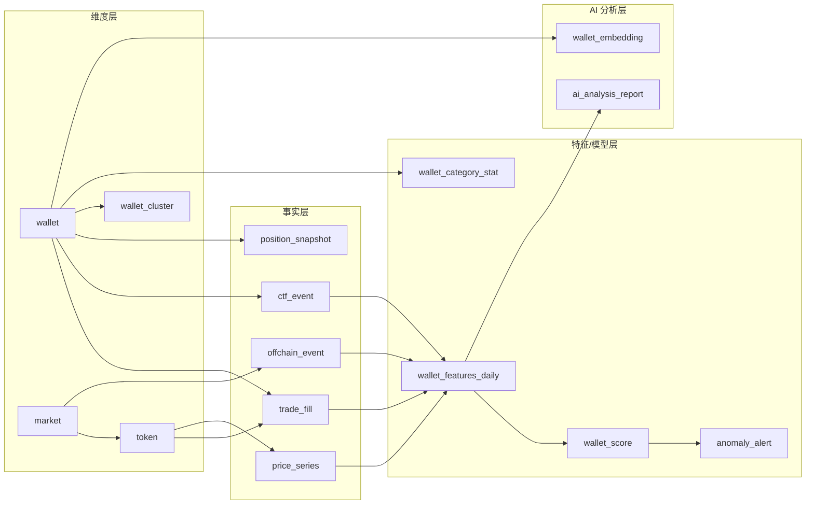

# Polymarket Smart Wallet Analyzer — Product Architecture

## 1. Product Overview

**Product Name:** Easy Arbitra — Smart Wallet Analyzer

**Core Value:** 跟踪 Polymarket 上盈利钱包的交易数据，通过三层归因框架（绩效事实 → 策略类型 → 信息优势）解释其盈利来源，区分运气、统计策略、信息处理优势与内幕嫌疑。**以 Amazon Nova AI 为分析大脑**，提供智能归因推理、自然语言洞察和语音交互。

**Target Users:** Polymarket 交易者、预测市场研究员、链上分析师

**Hackathon:** [Amazon Nova AI Hackathon](https://amazon-nova.devpost.com/) — 赛道：**Agentic AI**
- 截止日期：2026-03-16 5:00pm PDT
- 评分：Technical Implementation (60%) + Impact (20%) + Creativity (20%)
- 要求使用：Nova 2 Lite / Nova 2 Sonic / Nova Multimodal Embeddings / Nova Act

**Core Principle:** 产品输出的是「概率性判断 + 可回放证据」，而非定罪式指控。所有涉及「内幕嫌疑」的标签默认不公开，仅以「异常」+「置信度」+「免责声明」形式呈现。

---

## 2. Three-Layer Attribution Framework (核心模型)

产品的分析引擎采用三层递进归因：

```
Layer 1: Facts (绩效事实)
  ├── 统一口径 PnL 计算（Trading PnL / Maker Rebates / Fee Attribution）
  ├── 胜率、ROI、回撤、资金周转
  └── 按事件/市场/类别拆分收益来源

Layer 2: Strategy (策略类型)
  ├── 行为聚类 → 做市型 / 事件型 / 统计型 / 套利对冲型 / 短线噪声型 / 一次性好运型
  ├── 规则 + 聚类 + 弱监督结合
  └── 可解释证据（指标对比、典型交易片段、时序图）

Layer 3: Information Edge (信息优势)
  ├── 对每笔交易评估「信息时点优势」(Δt = 建仓时间 − 信息事件时间)
  ├── 聚合为钱包级「信息优势评分」
  └── 区分「处理公开信息更快」vs「可能的非公开信息」
```

### 2.1 Layer 1: PnL Accounting (收益会计口径)

从 MVP 开始就必须做对的口径：

| 口径 | 定义 | 数据源 |
|------|------|--------|
| **Realized PnL** | 平仓/赎回后落袋的收益 | Data API positions + PnL subgraph |
| **Unrealized PnL** | 按当前 mid price 估值的浮盈浮亏 | CLOB API midpoint + Positions subgraph |
| **Trading PnL** | 买入价 p → 结果为 Yes(1)/No(0) 的收益 | trade_fill 事实表计算 |
| **Maker Rebates** | 在启用 taker fee 的市场中做市者获得的返佣 | Orders subgraph + fee 市场标记 |
| **Fee & Cost Attribution** | taker fee + 桥接损耗 + gas（若可观测） | 链上 tx + Bridge API |
| **Event-level PnL** | 按市场/事件归因，识别「一个大事件赚了全部钱」vs「分散稳定」 | trade_fill 聚合 |

### 2.2 Layer 2: Strategy Classification (策略分群)

采用「行为聚类 + 规则引擎」结合，而非硬编码阈值：

| 策略类型 | 定义 | 核心判定特征 |
|----------|------|-------------|
| **做市型 (Market Maker)** | 双边挂单赚价差与返佣 | maker_ratio > 70%, 同市场双向持仓, 高 volume/低方向性 PnL, 高 split/merge 频率 |
| **事件型 (Event Trader)** | 围绕特定事件建仓，高集中度 | 高事件集中度(Top-3 share > 60%), 持仓时长短, 与事件时间线强相关 |
| **统计型 (Quant/Analytical)** | 模型化定价，分散下注 | 跨市场分散, 稳定正 edge, 费用敏感, 逆向入场倾向, Kelly-like 仓位管理 |
| **套利对冲型 (Arbitrage/Hedge)** | 跨市场/跨平台套利或对冲 | 同事件 Yes/No 双边持仓, 跨事件相关性对冲, 低方向性风险暴露 |
| **短线噪声型 (Noise/Retail)** | 追涨杀跌，无持续优势 | 负 edge, 追涨行为(价格上涨后买入), 小仓位高频, PnL 持续为负 |
| **一次性好运型 (Lucky)** | 少量交易偶然获利 | 交易样本 < 30, Top-1 事件贡献 > 80%, 跨窗口不稳定, 统计不显著 |

### 2.3 Layer 3: Information Edge Attribution (信息优势归因)

四级归因，证据强弱递进：

#### 运气型 (Luck-driven)
- 交易样本量小，PnL 集中在 1-2 个事件
- 入场价格隐含概率基准下，胜率/边际收益统计不显著 (p > 0.05)
- **检验方法：**
  - 稳定性检验：7D/30D/90D 滚动窗口，单窗口异常其余随机
  - 事件集中度：Herfindahl / Top-K share
  - 反事实置换检验：保持交易规模与次数，随机映射到同期其他市场价格序列

#### 统计策略型 (Quant/Analytical)
- 覆盖市场多、分散度高，长期稳定赚钱
- 买入边际收益 (outcome − p) 长期为正，低波动低回撤
- **检验方法：**
  - 跨市场分散与一致性：多类别维持正 edge
  - 价格偏离敏感：赔率偏离后逆向入场 + 止盈
  - 费用敏感性：在 taker fee 市场仍保持正 edge

#### 信息优势型 (Information Processing Edge)
- **不等于内幕**：公开信息的处理成本差异也会导致少数参与者先交易
- 信息事件前显著提前建仓，时间窗口稳定 (e.g. 总是提前 30-90 分钟)
- **检验方法：**
  - 事件研究 (Event Study)：以信息事件为 t=0，观察 t<0 的净买入与后续价格变动
  - Δt 分布显著偏负：首次建仓时间显著早于同市场普通用户
  - 价格影响代理：建仓后短期价格变化幅度

#### 内幕嫌疑型 (Insider-Suspected)
- **最高风险等级**，默认不公开。需多证据叠加：
  - 高度聚焦：只交易某一小圈子事件
  - 信息窗口极窄且收益极高，可重复出现
  - 资金与对手关系异常：与特定地址簇稳定资金往来
- **产品输出：** 「异常证据清单 + 置信度 + 误报提示 + 数据可回放链接」

---

## 3. Feature Engineering (特征工程)

钱包级特征分 5 族，落地到 `wallet_features_daily` 表：

### 3.1 绩效与风险 (Performance/Risk)

| 特征 | 计算要点 | 判别价值 |
|------|---------|---------|
| `pnl_7d / pnl_30d / pnl_90d` | 滚动窗口 realized PnL | 区分长期赚钱 vs 偶然爆赚 |
| `roi_30d` | 投入资金口径：sum(abs(cash_outflow)) | 收益效率 |
| `win_rate_by_event` | 按事件计算胜率 | 区分事件级 vs 交易级胜率 |
| `max_drawdown_90d` | 最大回撤 | 风险控制能力 |
| `event_concentration_top1 / top3` | Top-1/3 事件 PnL 占比 (Herfindahl) | 区分运气 vs 持续优势 |
| `avg_edge` | 平均边际收益 (outcome − entry_price) | 核心 alpha 指标 |
| `sharpe_ratio` | 收益 / 波动率 | 风险调整后收益 |

### 3.2 交易风格 (Style)

| 特征 | 计算要点 | 判别价值 |
|------|---------|---------|
| `avg_hold_time / median_hold_time` | 建仓到平仓/赎回的时长分布 | 区分短线 vs 长线 vs 持有到期 |
| `trade_count / active_days` | 交易活跃度 | 统计显著性基础 |
| `maker_ratio` | 成交中 maker 身份占比 | 识别做市行为 |
| `order_cancel_ratio` | 订单取消率（如可得） | 做市/算法交易特征 |
| `category_distribution` | 各类别交易占比 | 识别领域集中度 |

### 3.3 信息时点 (Timing/Edge)

| 特征 | 计算要点 | 判别价值 |
|------|---------|---------|
| `mean_pre_event_delta` | 相对 offchain_event 的提前量 (负数=提前) | 信息优势核心指标 |
| `early_entry_rate` | 事件前 X 分钟内建仓的比例 | 持续性信息优势 |
| `price_impact_proxy` | 建仓后短期价格变化幅度 | 信息含量代理 |

### 3.4 做市/库存 (MM/Inventory)

| 特征 | 计算要点 | 判别价值 |
|------|---------|---------|
| `spread_capture_proxy` | 在 fee 市场/高流动市场的价差收益代理 | 做市收益 |
| `inventory_turnover` | 持仓周转率 | 做市效率 |
| `split_merge_frequency` | split/merge 操作频率 | 做市需要频繁构建库存 |

### 3.5 自动化/执行 (Automation/Execution)

| 特征 | 计算要点 | 判别价值 |
|------|---------|---------|
| `tx_time_entropy` | 交易小时分布熵 | 低熵=固定时段人工；高熵=24h 机器人 |
| `tx_frequency` | 单位时间交易密度 | 自动化程度 |
| `gas_pattern_features` | gas 模式（非 gasless 场景） | 机器人/脚本特征 |
| `batch_operation_ratio` | 批量操作比例 | 脚本化程度 |

---

## 4. Amazon Nova AI Integration (AI 分析层)

Amazon Nova 作为产品的「AI 分析大脑」，深度嵌入三层归因框架的每一层。

### 4.1 Architecture Overview

```
┌─────────────────────────────────────────────────────────────┐
│                 Amazon Nova AI Analysis Layer                │
│                                                             │
│  ┌────────────────────────────────────────────────────────┐ │
│  │ Nova 2 Lite (Agentic AI Core)                         │ │
│  │  ├── Tool Calling → Polymarket API 智能编排            │ │
│  │  ├── Extended Thinking → 三层归因深度推理              │ │
│  │  ├── Code Interpreter → 统计检验即时计算              │ │
│  │  ├── Structured Output → 钱包画像 JSON                │ │
│  │  └── Natural Language → 可读分析报告生成              │ │
│  └────────────────────────────────────────────────────────┘ │
│                                                             │
│  ┌──────────────────┐  ┌─────────────────────────────────┐ │
│  │ Nova 2 Sonic     │  │ Nova Multimodal Embeddings      │ │
│  │ 语音交互查询     │  │ 钱包行为向量化 → 相似度聚类     │ │
│  │ 实时对话式分析   │  │ 异常检测 (与已知模式的距离)     │ │
│  └──────────────────┘  └─────────────────────────────────┘ │
│                                                             │
│  ┌────────────────────────────────────────────────────────┐ │
│  │ Nova Act (Browser Agent)                               │ │
│  │ 自动浏览 Polymarket 页面 → 采集无 API 数据             │ │
│  │ 自动截图钱包/市场页面 → 多模态分析验证                 │ │
│  └────────────────────────────────────────────────────────┘ │
└─────────────────────────────────────────────────────────────┘
```

### 4.2 Nova 2 Lite — Agentic AI Core

Nova 2 Lite (1M token context, $0.30/M input) 是核心分析引擎，通过 AWS Bedrock Converse API 调用。

#### 4.2.1 Tool Calling → 智能数据编排

定义一组 tools，让 Nova Agent 自主决定调用哪些 Polymarket API 采集数据：

```go
// internal/ai/nova_tools.go

var NovaTools = []BedrockTool{
    {
        Name:        "get_wallet_trades",
        Description: "Fetch trade history for a Polymarket wallet. Returns side, price, size, market, timestamp.",
        InputSchema: JSONSchema{
            Type: "object",
            Properties: map[string]JSONSchema{
                "address": {Type: "string", Description: "Wallet address (0x...)"},
                "limit":   {Type: "integer", Description: "Max trades to return (default 200)"},
                "from":    {Type: "string", Description: "Start date (ISO 8601)"},
            },
            Required: []string{"address"},
        },
    },
    {
        Name:        "get_wallet_positions",
        Description: "Fetch current open positions and PnL for a wallet.",
        InputSchema: JSONSchema{
            Type: "object",
            Properties: map[string]JSONSchema{
                "address":  {Type: "string"},
                "sort_by":  {Type: "string", Enum: []string{"CASHPNL", "PERCENTPNL", "CURRENT", "SIZE"}},
            },
            Required: []string{"address"},
        },
    },
    {
        Name:        "get_market_info",
        Description: "Fetch market metadata: title, category, status, volume, resolution outcome.",
        InputSchema: JSONSchema{
            Type: "object",
            Properties: map[string]JSONSchema{
                "market_id": {Type: "string", Description: "Condition ID or slug"},
            },
            Required: []string{"market_id"},
        },
    },
    {
        Name:        "get_price_history",
        Description: "Fetch historical price series for a market token. Used for timing analysis.",
        InputSchema: JSONSchema{
            Type: "object",
            Properties: map[string]JSONSchema{
                "token_id": {Type: "string"},
                "interval": {Type: "string", Enum: []string{"1m", "5m", "1h", "1d"}},
            },
            Required: []string{"token_id"},
        },
    },
    {
        Name:        "get_market_offchain_events",
        Description: "Fetch news/announcement timeline for a market. Used to calculate information timing advantage (Δt).",
        InputSchema: JSONSchema{
            Type: "object",
            Properties: map[string]JSONSchema{
                "market_id": {Type: "string"},
            },
            Required: []string{"market_id"},
        },
    },
    {
        Name:        "get_wallet_features",
        Description: "Fetch pre-computed daily features for a wallet (PnL, win rate, maker ratio, timing, etc.).",
        InputSchema: JSONSchema{
            Type: "object",
            Properties: map[string]JSONSchema{
                "address": {Type: "string"},
                "days":    {Type: "integer", Description: "Number of days of history (default 90)"},
            },
            Required: []string{"address"},
        },
    },
    {
        Name:        "search_similar_wallets",
        Description: "Find wallets with similar trading behavior using embedding similarity.",
        InputSchema: JSONSchema{
            Type: "object",
            Properties: map[string]JSONSchema{
                "address": {Type: "string"},
                "top_k":   {Type: "integer", Description: "Number of similar wallets (default 10)"},
            },
            Required: []string{"address"},
        },
    },
}
```

Nova Agent workflow: 用户输入钱包地址 → Nova 自主调用多个 tools → 收集数据 → 多步推理 → 输出结构化归因报告。

#### 4.2.2 Extended Thinking → 三层归因推理

利用 Nova 2 Lite 的 extended thinking (intensity: high) 和 1M token context，将钱包全量数据一次性输入做深度归因：

```go
// internal/ai/wallet_analyzer.go

func (a *WalletAnalyzer) AnalyzeWallet(ctx context.Context, address string) (*WalletAnalysisReport, error) {
    // 1. Prepare context: features + trades + markets + offchain events
    features, _ := a.featureRepo.GetLatest(ctx, address)
    trades, _ := a.tradeRepo.GetRecent(ctx, address, 90) // last 90 days
    markets, _ := a.marketRepo.GetByWallet(ctx, address)
    events, _ := a.offchainRepo.GetByMarkets(ctx, marketIDs)

    // 2. Build analysis prompt with Three-Layer Attribution Framework
    prompt := buildAnalysisPrompt(features, trades, markets, events)

    // 3. Call Nova 2 Lite via Bedrock Converse API with tools + structured output
    resp, err := a.bedrock.Converse(ctx, &bedrock.ConverseInput{
        ModelId: "us.amazon.nova-2-lite-v1:0",
        Messages: []bedrock.Message{{
            Role: "user",
            Content: []bedrock.ContentBlock{{Text: prompt}},
        }},
        System: []bedrock.SystemContentBlock{{
            Text: ThreeLayerAttributionSystemPrompt,
        }},
        InferenceConfig: &bedrock.InferenceConfig{
            MaxTokens:   4096,
            Temperature: 0, // greedy for structured output
        },
        ToolConfig: &bedrock.ToolConfig{
            Tools:      NovaTools,
            ToolChoice: &bedrock.ToolChoice{Tool: &bedrock.SpecificTool{Name: "output_analysis"}},
        },
    })

    // 4. Parse structured output → WalletAnalysisReport
    return parseAnalysisResponse(resp)
}
```

System prompt 核心指令：

```
You are a Polymarket Smart Wallet Analyst. Apply the Three-Layer Attribution Framework:

## Layer 1: Facts (绩效事实)
Calculate and decompose PnL into: Trading PnL, Maker Rebates, Fee Attribution.
Compute: win rate (by event), ROI, max drawdown, Sharpe ratio.
Calculate event concentration (Herfindahl index of Top-1/Top-3 events).

## Layer 2: Strategy (策略类型)
Classify wallet into one of: market_maker, event_trader, quant, arb_hedge, noise, lucky.
Provide specific evidence from the data (maker_ratio, category distribution, hold times, etc.).

## Layer 3: Information Edge (信息优势)
Assess information timing advantage by comparing trade timestamps with offchain events.
Calculate mean Δt (trade time minus event time). Negative = traded before event.
Classify as: luck / quant / processing_edge / insider_suspected.

## Rules
- Use statistical rigor: report confidence intervals and p-values where applicable.
- "insider_suspected" requires multiple converging evidence; never use lightly.
- Generate a natural language summary that a non-technical user can understand.
- All claims must reference specific data points from the provided trades/features.
```

#### 4.2.3 Code Interpreter → 统计检验即时计算

Nova 2 Lite 内置 Python code interpreter (sandbox)，用于即时执行复杂统计计算：

```go
// 启用 code interpreter 作为系统 tool
systemTools := []bedrock.SystemTool{
    {Type: "nova_code_interpreter"}, // Python sandbox
}
```

Code interpreter 自动执行的计算：
- **反事实置换检验**：Bootstrap 生成 PnL 分布 → p-value
- **Herfindahl 集中度指数**：衡量收益集中度
- **滚动窗口稳定性检验**：7D/30D/90D 胜率与 edge 一致性
- **Sharpe Ratio / Max Drawdown**：风险调整收益
- **Δt 分布统计检验**：Wilcoxon signed-rank test 检验建仓提前量

#### 4.2.4 Structured Output → Constrained Decoding

利用 Nova 的 constrained decoding (schema 合规率 >95%)，强制输出结构化画像：

```go
// 定义 output tool 作为 structured output schema
var OutputAnalysisTool = BedrockTool{
    Name:        "output_analysis",
    Description: "Output the complete wallet analysis report as structured data.",
    InputSchema: JSONSchema{
        Type: "object",
        Properties: map[string]JSONSchema{
            "layer1_facts": {
                Type: "object",
                Properties: map[string]JSONSchema{
                    "realized_pnl":              {Type: "number"},
                    "unrealized_pnl":            {Type: "number"},
                    "trading_pnl":               {Type: "number"},
                    "maker_rebates":             {Type: "number"},
                    "fees_paid":                 {Type: "number"},
                    "win_rate_7d":               {Type: "number"},
                    "win_rate_30d":              {Type: "number"},
                    "win_rate_90d":              {Type: "number"},
                    "roi_30d":                   {Type: "number"},
                    "max_drawdown_90d":          {Type: "number"},
                    "sharpe_ratio":              {Type: "number"},
                    "event_concentration_hhi":   {Type: "number"},
                    "event_concentration_top3":  {Type: "number"},
                },
            },
            "layer2_strategy": {
                Type: "object",
                Properties: map[string]JSONSchema{
                    "primary_type":    {Type: "string", Enum: []string{"market_maker", "event_trader", "quant", "arb_hedge", "noise", "lucky"}},
                    "confidence":      {Type: "number"},
                    "evidence_points": {Type: "array", Items: &JSONSchema{Type: "string"}},
                    "evidence_summary":{Type: "string"},
                },
            },
            "layer3_info_edge": {
                Type: "object",
                Properties: map[string]JSONSchema{
                    "level":                  {Type: "string", Enum: []string{"luck", "quant", "processing_edge", "insider_suspected"}},
                    "confidence":             {Type: "number"},
                    "mean_delta_t_minutes":   {Type: "number"},
                    "early_entry_rate":       {Type: "number"},
                    "p_value_timing":         {Type: "number"},
                    "evidence_summary":       {Type: "string"},
                },
            },
            "smart_score":              {Type: "integer"},
            "natural_language_summary": {Type: "string"},
            "risk_warnings":            {Type: "array", Items: &JSONSchema{Type: "string"}},
        },
        Required: []string{"layer1_facts", "layer2_strategy", "layer3_info_edge", "smart_score", "natural_language_summary"},
    },
}
```

### 4.3 Nova Multimodal Embeddings — 钱包行为相似度

将钱包的特征向量通过 Nova Multimodal Embeddings 转化为语义向量，支撑三个功能：

#### 4.3.1 钱包行为聚类

```go
// internal/ai/embedding_service.go

func (s *EmbeddingService) ComputeWalletEmbedding(ctx context.Context, walletID int64) ([]float32, error) {
    features, _ := s.featureRepo.GetLatest(ctx, walletID)

    // 将特征格式化为文本描述，让 Nova Embeddings 理解语义
    description := fmt.Sprintf(
        "Polymarket wallet: PnL30d=%.2f, WinRate=%.4f, MakerRatio=%.4f, "+
        "UniqueMarkets=%d, AvgHoldHours=%.1f, TxTimeEntropy=%.2f, "+
        "EventConcentrationTop3=%.4f, MeanPreEventDelta=%.1fmin, "+
        "Categories: %s",
        features.PnL30d, features.WinRateByEvent, features.MakerRatio,
        features.UniqueMarkets30d, features.AvgHoldHours, features.TxTimeEntropy,
        features.EventConcentrationTop3, features.MeanPreEventDeltaMin,
        features.CategoryDistributionString(),
    )

    resp, err := s.bedrock.InvokeModel(ctx, &bedrock.InvokeModelInput{
        ModelId: "amazon.nova-embed-multimodal-v1:0",
        Body:    marshalEmbeddingRequest(description),
    })
    return parseEmbeddingResponse(resp)
}
```

用途：
- **相似钱包推荐**：「与此钱包行为最相似的 Top 10 钱包」
- **实体归并**：embedding 距离极近的地址可能属于同一操盘手
- **异常检测**：新钱包的 embedding 与已知「insider_suspected」钱包集群的距离

#### 4.3.2 数据库存储与检索

```sql
-- 钱包 embedding 表
CREATE TABLE wallet_embedding (
    wallet_id       BIGINT PRIMARY KEY REFERENCES wallet(id),
    embedding       VECTOR(1024),                       -- Nova embedding dimension
    computed_at     TIMESTAMPTZ NOT NULL,
    created_at      TIMESTAMPTZ DEFAULT NOW()
);

-- pgvector 索引用于相似度搜索
CREATE INDEX idx_wallet_embedding ON wallet_embedding USING ivfflat (embedding vector_cosine_ops) WITH (lists = 100);
```

```sql
-- 相似钱包查询
SELECT w.id, w.address, w.pseudonym,
       1 - (we.embedding <=> target_embedding) AS similarity
FROM wallet_embedding we
JOIN wallet w ON w.id = we.wallet_id
WHERE we.wallet_id != $1
ORDER BY we.embedding <=> target_embedding
LIMIT 10;
```

### 4.4 Nova 2 Sonic — 语音交互分析

用户可以通过语音自然语言查询钱包分析结果，Nova 2 Sonic 提供 speech-to-speech 实时对话：

```go
// internal/ai/voice_service.go

// WebSocket handler for voice interaction
func (s *VoiceService) HandleVoiceSession(conn *websocket.Conn) {
    // 1. 接收用户语音流 (PCM audio chunks)
    // 2. 发送到 Nova 2 Sonic (Bedrock streaming)
    // 3. Nova 2 Sonic 理解意图 → 调用 tools 获取数据 → 生成语音回复
    // 4. 流式返回语音响应

    stream, _ := s.bedrock.ConverseStream(ctx, &bedrock.ConverseStreamInput{
        ModelId: "amazon.nova-2-sonic-v1:0",
        Messages: messages,
        ToolConfig: &bedrock.ToolConfig{
            Tools: NovaTools, // 复用同一套 tools
        },
    })
    // ... stream audio back to client
}
```

对话示例：
```
用户 (语音): "帮我分析一下钱包 0x1234 最近的表现"
Nova Sonic: "这个钱包过去 30 天盈利 1.2 万美金，主要集中在政治类市场。
            策略类型判定为统计分析型，置信度 82%。Smart Score 78 分。
            值得注意的是，它在最近 3 个政治事件中平均提前 42 分钟建仓，
            显示出较强的信息处理优势。需要我详细解释某个方面吗？"
用户 (语音): "它跟哪些钱包行为比较像？"
Nova Sonic: "通过行为相似度分析，找到 3 个高度相似的钱包：
            第一个 0xABCD，同样是统计型，Smart Score 72 分...
            第二个 0xEF01，政治类市场专精，胜率更高但交易更少..."
```

### 4.5 Nova Act — 浏览器自动化采集

Nova Act (browser agent, $4.75/agent-hour) 用于采集 Polymarket 上无 API 暴露的数据：

```go
// internal/ai/browser_agent.go

func (a *BrowserAgent) ScrapeLeaderboardProfiles(ctx context.Context) error {
    // Nova Act 自动化流程:
    // 1. 打开 Polymarket 排行榜页面
    // 2. 逐一访问 top wallet 的 Profile 页面
    // 3. 截图 → 通过 Nova multimodal 提取补充数据
    //    (如：用户 bio、社交链接、badges 等 API 未暴露的信息)
    // 4. 发现新的盈利钱包 → 加入 tracking 列表
    return a.novaAct.ExecuteWorkflow(ctx, LeaderboardScrapeWorkflow)
}
```

使用场景：
- 自动发现排行榜新上榜的盈利钱包
- 截图钱包 Profile 页面 → Nova multimodal 提取非结构化信息
- 监控新市场创建 → 补充 Gamma API 未及时更新的元数据
- 竞品分析：自动浏览 Hashdive/PolyTrack 等平台收集对比数据

### 4.6 Nova AI Analysis Flow (端到端流程)

```
User Request: "分析钱包 0x1234"
        │
        ▼
┌───────────────────────────────────────────────────────────┐
│ Step 1: Nova 2 Lite Agent 接收请求                         │
│   → 决定需要调用哪些 tools                                 │
└──────────────┬────────────────────────────────────────────┘
               │
        ┌──────▼──────┐
        │ Tool Calls  │ (Nova 自主编排, 可能多轮)
        │ ┌─────────┐ │
        │ │trades   │ │──→ Polymarket Data API
        │ │positions│ │──→ Polymarket Data API
        │ │markets  │ │──→ Polymarket Gamma API
        │ │features │ │──→ PostgreSQL (pre-computed)
        │ │events   │ │──→ offchain_event table
        │ │similar  │ │──→ Nova Embeddings + pgvector
        │ └─────────┘ │
        └──────┬──────┘
               │ all data collected
               ▼
┌───────────────────────────────────────────────────────────┐
│ Step 2: Extended Thinking (intensity: high)                │
│   → Layer 1: PnL decomposition + risk metrics             │
│   → Layer 2: Strategy classification + evidence            │
│   → Layer 3: Information edge Δt + counterfactual          │
└──────────────┬────────────────────────────────────────────┘
               │
               ▼
┌───────────────────────────────────────────────────────────┐
│ Step 3: Code Interpreter (Python sandbox)                  │
│   → Bootstrap p-value for win rate significance            │
│   → Herfindahl concentration index                         │
│   → Δt Wilcoxon signed-rank test                           │
│   → Sharpe ratio / max drawdown calculation                │
└──────────────┬────────────────────────────────────────────┘
               │
               ▼
┌───────────────────────────────────────────────────────────┐
│ Step 4: Structured Output (constrained decoding)           │
│   → WalletAnalysisReport JSON                              │
│   → natural_language_summary (可读报告)                     │
│   → risk_warnings (合规免责)                                │
└──────────────┬────────────────────────────────────────────┘
               │
               ▼
┌───────────────────────────────────────────────────────────┐
│ Step 5: Store & Serve                                      │
│   → wallet_score table (策略 + 信息优势 + Smart Score)     │
│   → ai_analysis_report table (完整报告缓存)               │
│   → Return to frontend via REST API                        │
└───────────────────────────────────────────────────────────┘
```

### 4.7 Cost Estimation (Nova AI 成本)

| Model | Usage | Est. Cost |
|-------|-------|-----------|
| **Nova 2 Lite** | ~50K tokens/wallet analysis, ~100 wallets/day | ~$1.40/day |
| **Nova Embeddings** | ~500 wallets * 200 tokens | ~$0.006/day |
| **Nova 2 Sonic** | ~10 voice sessions/day, ~3 min each | ~$0.50/day |
| **Nova Act** | ~1 hour/day scraping | ~$4.75/day |
| **Total estimated** | | **~$6.65/day** |

---

## 5. Data Architecture

### 5.1 Data Sources (按优先级)

| 优先级 | 数据源 | 关键数据 | 频率 | Auth |
|--------|--------|---------|------|------|
| **P0** | Polymarket Data API | 用户 trades/positions/activity/leaderboard | 5-15 min | No |
| **P0** | Polymarket Gamma API | 市场元数据/标签/events/categories | 10 min | No |
| **P0** | Polymarket CLOB API | orderbook/midpoint/spread/price history | 10-30 sec | No (read) |
| **P0** | Polymarket Subgraphs (Goldsky) | Positions/Orders/Activity/OI/PNL GraphQL | 近实时 | No |
| **P1** | Polygon RPC (Alchemy/Infura) | tx/logs/合约事件/内部调用 | 实时 | API Key |
| **P1** | 区块浏览器 API (PolygonScan) | 合约 ABI/辅助查询 | 秒级 | API Key |
| **P2** | 链下新闻/社交媒体时间线 | 信息事件 t=0 锚点 | 1-5 min | 按源 |

### 5.2 Data Collection Pipeline

```
┌──────────────────────────────────────────────────────────────┐
│                        Data Sources                           │
│  ┌─────────┐ ┌───────────┐ ┌──────┐ ┌─────────┐ ┌────────┐ │
│  │Gamma API│ │ Data API  │ │ CLOB │ │Subgraph │ │News/RSS│ │
│  └────┬────┘ └─────┬─────┘ └──┬───┘ └────┬────┘ └───┬────┘ │
└───────┼────────────┼──────────┼──────────┼──────────┼────────┘
        │            │          │          │          │
┌───────▼────────────▼──────────▼──────────▼──────────▼────────┐
│                    Task Scheduler (cron)                       │
│  market_sync │ trade_sync │ price_sync │ ctf_event │ news    │
└──────────────────────────┬───────────────────────────────────┘
                           │
┌──────────────────────────▼───────────────────────────────────┐
│              Ingestion Workers (goroutines)                    │
│  ┌─────────────────────────────────────────────────────────┐ │
│  │  1. Fetch (rate-limited, retry with exponential backoff) │ │
│  │  2. Normalize (address format, UTC timestamps)           │ │
│  │  3. Deduplicate (tx_hash + log_index as uniq_key)        │ │
│  │  4. Upsert (INSERT ... ON CONFLICT DO UPDATE/NOTHING)    │ │
│  └─────────────────────────────────────────────────────────┘ │
└──────────────────────────┬───────────────────────────────────┘
                           │
┌──────────────────────────▼───────────────────────────────────┐
│                    PostgreSQL Database                         │
│  ┌──────────┐ ┌────────────┐ ┌──────────────────┐           │
│  │ Facts    │ │ Dimensions │ │ Features/Scores  │           │
│  │ (事实层) │ │ (维度层)   │ │ (特征/模型层)    │           │
│  └──────────┘ └────────────┘ └──────────────────┘           │
└──────────────────────────┬───────────────────────────────────┘
                           │
┌──────────────────────────▼───────────────────────────────────┐
│              Analytics Workers (goroutines)                    │
│  feature_build │ score_refresh │ cluster_update │ alert_scan │
└──────────────────────────┬───────────────────────────────────┘
                           │
┌──────────────────────────▼───────────────────────────────────┐
│                 Gin REST API → Next.js Frontend               │
└───────────────────────────────────────────────────────────────┘
```

### 5.3 Task Scheduler Configuration

| Task | Frequency | Description |
|------|-----------|-------------|
| `market_sync` | 10 min | Gamma API 拉取新增/变更 market & event 元数据 |
| `trade_sync` | 1-5 min | Data API + Orders subgraph 增量拉取成交 |
| `ctf_event_sync` | 5-15 min | Activity subgraph 拉取 split/merge/redeem |
| `price_sync` | 30 sec (可选) | CLOB API midpoint/spread 用于 unrealized PnL |
| `offchain_event_sync` | 1-5 min | RSS/公告/比分官方源 → 构建信息事件时间线 |
| `feature_build` | 1 hour / daily | 滚动计算钱包特征 (wallet_features_daily) |
| `score_refresh` | 特征更新后触发 | 策略分群 + 信息优势评分 + Smart Score |
| `cluster_update` | daily | 钱包实体聚类更新 (代理钱包/多地址归并) |
| `alert_scan` | 5 min | 异常检测 → 生成 insider alerts |
| `leaderboard_scan` | 6 hours | 发现新的盈利钱包 |
| `snapshot_build` | daily | 每日钱包快照 |

---

## 6. Database Schema (PostgreSQL + GORM)

采用「事实-维度-特征-评分」分层设计。地址用 `bytea` 存储节省空间，高频事实表按时间分区。

### 6.1 Dimension Tables (维度层)

```sql
-- 钱包维度
CREATE TABLE wallet (
    id              BIGSERIAL PRIMARY KEY,
    address         BYTEA NOT NULL,                     -- 20 bytes, hex 展示由应用层处理
    chain_id        INT NOT NULL DEFAULT 137,           -- Polygon
    wallet_kind     SMALLINT NOT NULL DEFAULT 9,        -- 0=EOA, 1=Proxy, 2=Safe, 9=Unknown
    pseudonym       VARCHAR(100),                       -- Polymarket display name
    first_seen_at   TIMESTAMPTZ NOT NULL,
    last_seen_at    TIMESTAMPTZ,
    cluster_id      BIGINT,                             -- 指向 wallet_cluster
    is_tracked      BOOLEAN DEFAULT FALSE,
    created_at      TIMESTAMPTZ DEFAULT NOW(),
    updated_at      TIMESTAMPTZ DEFAULT NOW(),
    UNIQUE(address, chain_id)
);
CREATE INDEX idx_wallet_cluster ON wallet(cluster_id);
CREATE INDEX idx_wallet_kind ON wallet(wallet_kind);
CREATE INDEX idx_wallet_tracked ON wallet(is_tracked);

-- 钱包实体聚类 (将代理钱包/多地址归并为「实体」)
CREATE TABLE wallet_cluster (
    id              BIGSERIAL PRIMARY KEY,
    label           VARCHAR(200),                       -- 可选：已知实体名称
    confidence      DECIMAL(5,4) DEFAULT 0,             -- 聚类置信度
    evidence        JSONB,                              -- 聚类依据 (工厂合约/同 owner/资金源)
    wallet_count    INT DEFAULT 0,
    created_at      TIMESTAMPTZ DEFAULT NOW(),
    updated_at      TIMESTAMPTZ DEFAULT NOW()
);

-- 市场维度
CREATE TABLE market (
    id              BIGSERIAL PRIMARY KEY,
    condition_id    VARCHAR(66) UNIQUE NOT NULL,
    question_id     VARCHAR(66),
    slug            VARCHAR(255),
    title           TEXT NOT NULL,
    description     TEXT,
    category        VARCHAR(50),                        -- Politics, Crypto, Sports, etc.
    status          SMALLINT NOT NULL DEFAULT 0,        -- 0=active, 1=closed, 2=resolved
    has_fee         BOOLEAN DEFAULT FALSE,              -- 是否启用 taker fee
    open_time       TIMESTAMPTZ,
    close_time      TIMESTAMPTZ,
    resolution_time TIMESTAMPTZ,
    resolved_outcome SMALLINT,                          -- 0=No, 1=Yes, NULL=未解算
    volume          DECIMAL(20,2) DEFAULT 0,
    liquidity       DECIMAL(20,2) DEFAULT 0,
    created_at      TIMESTAMPTZ DEFAULT NOW(),
    updated_at      TIMESTAMPTZ DEFAULT NOW()
);
CREATE INDEX idx_market_category ON market(category);
CREATE INDEX idx_market_status ON market(status);

-- Token 维度 (Yes/No outcome tokens)
CREATE TABLE token (
    id              BIGSERIAL PRIMARY KEY,
    market_id       BIGINT NOT NULL REFERENCES market(id),
    token_id        VARCHAR(80) UNIQUE NOT NULL,        -- Polymarket CLOB token_id
    side            SMALLINT NOT NULL,                  -- 1=YES, 0=NO
    created_at      TIMESTAMPTZ DEFAULT NOW()
);
CREATE INDEX idx_token_market ON token(market_id);
```

### 6.2 Fact Tables (事实层)

```sql
-- 成交事实 (核心事实表, 建议按月分区)
CREATE TABLE trade_fill (
    id              BIGSERIAL PRIMARY KEY,
    token_id        BIGINT NOT NULL REFERENCES token(id),
    maker_wallet_id BIGINT REFERENCES wallet(id),
    taker_wallet_id BIGINT REFERENCES wallet(id),
    side            SMALLINT NOT NULL,                  -- 1=buy, 0=sell (taker perspective)
    price           NUMERIC(18,8) NOT NULL,
    size            NUMERIC(36,18) NOT NULL,
    fee_paid        NUMERIC(18,8) DEFAULT 0,
    tx_hash         BYTEA,
    block_number    BIGINT,
    block_time      TIMESTAMPTZ NOT NULL,
    source          SMALLINT NOT NULL DEFAULT 0,        -- 0=subgraph, 1=data_api
    uniq_key        VARCHAR(130) UNIQUE NOT NULL,       -- tx_hash + log_index dedupe
    created_at      TIMESTAMPTZ DEFAULT NOW()
);
CREATE INDEX idx_trade_maker ON trade_fill(maker_wallet_id);
CREATE INDEX idx_trade_taker ON trade_fill(taker_wallet_id);
CREATE INDEX idx_trade_token ON trade_fill(token_id);
CREATE INDEX idx_trade_time ON trade_fill(block_time);

-- CTF 头寸操作事实 (split/merge/redeem/transfer)
CREATE TABLE ctf_event (
    id              BIGSERIAL PRIMARY KEY,
    wallet_id       BIGINT NOT NULL REFERENCES wallet(id),
    market_id       BIGINT NOT NULL REFERENCES market(id),
    event_type      SMALLINT NOT NULL,                  -- 1=split, 2=merge, 3=redeem, 4=transfer
    usdc_amount     NUMERIC(18,8),
    token_amount    NUMERIC(36,18),
    tx_hash         BYTEA,
    block_number    BIGINT,
    block_time      TIMESTAMPTZ NOT NULL,
    uniq_key        VARCHAR(130) UNIQUE NOT NULL,
    created_at      TIMESTAMPTZ DEFAULT NOW()
);
CREATE INDEX idx_ctf_wallet ON ctf_event(wallet_id);
CREATE INDEX idx_ctf_market ON ctf_event(market_id);
CREATE INDEX idx_ctf_time ON ctf_event(block_time);

-- 价格序列 (用于 unrealized PnL 估值与回测)
CREATE TABLE price_series (
    id              BIGSERIAL PRIMARY KEY,
    token_id        BIGINT NOT NULL REFERENCES token(id),
    price           NUMERIC(18,8) NOT NULL,
    spread          NUMERIC(18,8),
    captured_at     TIMESTAMPTZ NOT NULL,
    created_at      TIMESTAMPTZ DEFAULT NOW()
);
CREATE INDEX idx_price_token_time ON price_series(token_id, captured_at);

-- 链下信息事件 (用于信息优势 Δt 计算)
CREATE TABLE offchain_event (
    id              BIGSERIAL PRIMARY KEY,
    market_id       BIGINT REFERENCES market(id),
    event_time      TIMESTAMPTZ NOT NULL,
    event_type      VARCHAR(30) NOT NULL,               -- breaking_news, official_result, odds_jump, oracle_proposal
    source_name     VARCHAR(100),                       -- reuters_rss, ap_news, official_api
    title           TEXT,
    payload         JSONB,                              -- { "url": "...", "summary": "..." }
    created_at      TIMESTAMPTZ DEFAULT NOW()
);
CREATE INDEX idx_offchain_market ON offchain_event(market_id);
CREATE INDEX idx_offchain_time ON offchain_event(event_time);

-- 头寸快照 (position_snapshot, 定期快照用于回测)
CREATE TABLE position_snapshot (
    id              BIGSERIAL PRIMARY KEY,
    wallet_id       BIGINT NOT NULL REFERENCES wallet(id),
    market_id       BIGINT NOT NULL REFERENCES market(id),
    outcome_index   SMALLINT NOT NULL,                  -- 0=No, 1=Yes
    size            NUMERIC(36,18) DEFAULT 0,
    avg_price       NUMERIC(18,8) DEFAULT 0,
    current_price   NUMERIC(18,8) DEFAULT 0,
    initial_value   NUMERIC(20,2) DEFAULT 0,
    current_value   NUMERIC(20,2) DEFAULT 0,
    realized_pnl    NUMERIC(20,2) DEFAULT 0,
    unrealized_pnl  NUMERIC(20,2) DEFAULT 0,
    status          SMALLINT DEFAULT 0,                 -- 0=open, 1=closed, 2=redeemed
    snapshot_at     TIMESTAMPTZ NOT NULL,
    created_at      TIMESTAMPTZ DEFAULT NOW()
);
CREATE INDEX idx_pos_wallet ON position_snapshot(wallet_id);
CREATE INDEX idx_pos_snap ON position_snapshot(snapshot_at);
```

### 6.3 Feature & Score Tables (特征/模型层)

```sql
-- 钱包每日特征 (用于回测、分群、可解释性)
CREATE TABLE wallet_features_daily (
    wallet_id               BIGINT NOT NULL REFERENCES wallet(id),
    feature_date            DATE NOT NULL,
    -- Performance/Risk
    pnl_7d                  NUMERIC(20,2) DEFAULT 0,
    pnl_30d                 NUMERIC(20,2) DEFAULT 0,
    pnl_90d                 NUMERIC(20,2) DEFAULT 0,
    roi_30d                 NUMERIC(10,6) DEFAULT 0,
    win_rate_by_event       NUMERIC(5,4) DEFAULT 0,
    max_drawdown_90d        NUMERIC(10,6) DEFAULT 0,
    event_concentration_top1 NUMERIC(5,4) DEFAULT 0,
    event_concentration_top3 NUMERIC(5,4) DEFAULT 0,
    avg_edge                NUMERIC(10,6) DEFAULT 0,
    -- Style
    avg_hold_hours          NUMERIC(10,2) DEFAULT 0,
    trade_count_30d         INT DEFAULT 0,
    active_days_30d         INT DEFAULT 0,
    maker_ratio             NUMERIC(5,4) DEFAULT 0,
    unique_markets_30d      INT DEFAULT 0,
    -- Timing/Edge
    mean_pre_event_delta_min NUMERIC(10,2),             -- 负数=提前
    early_entry_rate        NUMERIC(5,4) DEFAULT 0,
    price_impact_proxy      NUMERIC(10,6) DEFAULT 0,
    -- MM/Inventory
    spread_capture_proxy    NUMERIC(10,6) DEFAULT 0,
    inventory_turnover      NUMERIC(10,4) DEFAULT 0,
    split_merge_freq_30d    INT DEFAULT 0,
    -- Automation/Execution
    tx_time_entropy         NUMERIC(8,4) DEFAULT 0,
    tx_frequency_per_day    NUMERIC(8,2) DEFAULT 0,
    batch_op_ratio          NUMERIC(5,4) DEFAULT 0,
    -- Meta
    created_at              TIMESTAMPTZ DEFAULT NOW(),
    PRIMARY KEY (wallet_id, feature_date)
);

-- 钱包评分 (策略分群 + Smart Score + 信息优势)
CREATE TABLE wallet_score (
    id              BIGSERIAL PRIMARY KEY,
    wallet_id       BIGINT NOT NULL REFERENCES wallet(id),
    scored_at       TIMESTAMPTZ NOT NULL,
    -- Strategy cluster
    strategy_type   VARCHAR(30),                        -- market_maker/event_trader/quant/arb_hedge/noise/lucky
    strategy_confidence NUMERIC(5,4) DEFAULT 0,
    -- Information edge attribution
    info_edge_level VARCHAR(20),                        -- luck/quant/processing_edge/insider_suspected
    info_edge_confidence NUMERIC(5,4) DEFAULT 0,
    -- Smart Score (-100 to 100)
    smart_score     INT DEFAULT 0,
    -- Detailed scoring breakdown
    scoring_detail  JSONB,                              -- { "pnl_percentile": 0.95, "edge_consistency": 0.82, ... }
    -- Disclosures
    disclosures     TEXT[],                             -- 免责声明与方法说明
    created_at      TIMESTAMPTZ DEFAULT NOW()
);
CREATE INDEX idx_score_wallet ON wallet_score(wallet_id);
CREATE INDEX idx_score_strategy ON wallet_score(strategy_type);
CREATE INDEX idx_score_smart ON wallet_score(smart_score);

-- 钱包分类别绩效
CREATE TABLE wallet_category_stat (
    wallet_id       BIGINT NOT NULL REFERENCES wallet(id),
    category        VARCHAR(50) NOT NULL,
    trade_count     INT DEFAULT 0,
    win_count       INT DEFAULT 0,
    win_rate        NUMERIC(5,4) DEFAULT 0,
    total_volume    NUMERIC(20,2) DEFAULT 0,
    realized_pnl    NUMERIC(20,2) DEFAULT 0,
    avg_edge        NUMERIC(10,6) DEFAULT 0,
    updated_at      TIMESTAMPTZ DEFAULT NOW(),
    PRIMARY KEY (wallet_id, category)
);

-- 异常/告警 (审慎措辞, 非「内幕指控」)
CREATE TABLE anomaly_alert (
    id              BIGSERIAL PRIMARY KEY,
    wallet_id       BIGINT NOT NULL REFERENCES wallet(id),
    market_id       BIGINT REFERENCES market(id),
    alert_type      VARCHAR(30) NOT NULL,               -- fresh_wallet, large_position, pre_resolution_timing, dormancy, cluster_coordinated
    severity        SMALLINT NOT NULL DEFAULT 0,        -- 0=info, 1=low, 2=medium, 3=high
    evidence        JSONB NOT NULL,                     -- 可回放证据 { "delta_minutes": -15, "position_size": 50000, ... }
    description     TEXT,
    acknowledged    BOOLEAN DEFAULT FALSE,
    created_at      TIMESTAMPTZ DEFAULT NOW()
);
CREATE INDEX idx_alert_wallet ON anomaly_alert(wallet_id);
CREATE INDEX idx_alert_severity ON anomaly_alert(severity);
CREATE INDEX idx_alert_type ON anomaly_alert(alert_type);

-- 用户 watchlist
CREATE TABLE watchlist (
    id              BIGSERIAL PRIMARY KEY,
    user_id         BIGINT NOT NULL,
    wallet_id       BIGINT NOT NULL REFERENCES wallet(id),
    alias           VARCHAR(100),
    notes           TEXT,
    notify_trades   BOOLEAN DEFAULT TRUE,
    notify_anomaly  BOOLEAN DEFAULT FALSE,
    created_at      TIMESTAMPTZ DEFAULT NOW(),
    UNIQUE(user_id, wallet_id)
);

-- AI 分析报告缓存 (Nova 生成的完整报告)
CREATE TABLE ai_analysis_report (
    id              BIGSERIAL PRIMARY KEY,
    wallet_id       BIGINT NOT NULL REFERENCES wallet(id),
    model_id        VARCHAR(50) NOT NULL,               -- us.amazon.nova-2-lite-v1:0
    report          JSONB NOT NULL,                     -- 完整的三层归因 JSON
    nl_summary      TEXT,                               -- 自然语言摘要
    risk_warnings   TEXT[],
    input_tokens    INT,
    output_tokens   INT,
    latency_ms      INT,
    created_at      TIMESTAMPTZ DEFAULT NOW()
);
CREATE INDEX idx_ai_report_wallet ON ai_analysis_report(wallet_id);
CREATE INDEX idx_ai_report_time ON ai_analysis_report(created_at);

-- 钱包 embedding (Nova Multimodal Embeddings, 需要 pgvector 扩展)
-- CREATE EXTENSION IF NOT EXISTS vector;
CREATE TABLE wallet_embedding (
    wallet_id       BIGINT PRIMARY KEY REFERENCES wallet(id),
    embedding       VECTOR(1024),                       -- Nova embedding dimension
    computed_at     TIMESTAMPTZ NOT NULL,
    created_at      TIMESTAMPTZ DEFAULT NOW()
);
CREATE INDEX idx_wallet_embedding ON wallet_embedding USING ivfflat (embedding vector_cosine_ops) WITH (lists = 100);
```

### 6.4 ER Diagram



---

## 7. System Architecture

### 7.1 Overall Architecture

```
┌────────────────────────────────────────────────────────────────┐
│                      Frontend (Next.js + TailwindCSS)           │
│                                                                │
│  ┌──────────┐ ┌──────────┐ ┌───────────┐ ┌────────────────┐  │
│  │Dashboard │ │Wallet    │ │Leaderboard│ │Anomaly         │  │
│  │Overview  │ │Profile   │ │& Rankings │ │Alert Feed      │  │
│  └──────────┘ └──────────┘ └───────────┘ └────────────────┘  │
│  ┌──────────┐ ┌──────────┐ ┌───────────┐ ┌────────────────┐  │
│  │Market    │ │AI Chat & │ │Compare    │ │Methodology     │  │
│  │Explorer  │ │Voice     │ │Wallets    │ │& Disclosures   │  │
│  └──────────┘ └──────────┘ └───────────┘ └────────────────┘  │
│                                                                │
└───────────────────────────┬────────────────────────────────────┘
                            │ REST API + WebSocket (voice)
┌───────────────────────────▼────────────────────────────────────┐
│                       Backend (Go + Gin)                        │
│                                                                │
│  ┌──────────────────────────────────────────────────────────┐  │
│  │                   API Layer (Gin Router)                  │  │
│  │  /api/v1/wallets  /api/v1/markets  /api/v1/anomalies    │  │
│  │  /api/v1/ai       /api/v1/compare  /api/v1/watchlist    │  │
│  └─────────────────────────┬────────────────────────────────┘  │
│                             │                                  │
│  ┌──────────────────────────▼───────────────────────────────┐  │
│  │                    Service Layer                          │  │
│  │  WalletService    MarketService     AIAnalysisService    │  │
│  │  TradeService     FeatureService    EmbeddingService     │  │
│  │  ScoreService     ClusterService    VoiceService         │  │
│  │  AlertService     ExplanationService BrowserAgentService │  │
│  └──────────────────────────┬───────────────────────────────┘  │
│                             │                                  │
│  ┌──────────────────────────▼───────────────────────────────┐  │
│  │                  Repository Layer (GORM)                  │  │
│  │  WalletRepo  TradeRepo  MarketRepo  PositionRepo        │  │
│  │  FeatureRepo  ScoreRepo  AlertRepo  AIReportRepo        │  │
│  │  ClusterRepo  EmbeddingRepo  WatchlistRepo              │  │
│  └──────────────────────────┬───────────────────────────────┘  │
│                             │                                  │
│  ┌──────────────────────────▼───────────────────────────────┐  │
│  │              Background Workers (goroutines + cron)       │  │
│  │  ┌──────────────────┐  ┌──────────────────────────────┐  │  │
│  │  │ Ingestion Workers│  │ Analytics Workers             │  │  │
│  │  │  - TradeSyncer   │  │  - FeatureBuilder             │  │  │
│  │  │  - MarketSyncer  │  │  - ScoreCalculator            │  │  │
│  │  │  - CTFEventSyncer│  │  - ClusterUpdater             │  │  │
│  │  │  - PriceSyncer   │  │  - AnomalyDetector            │  │  │
│  │  │  - OffchainSyncer│  │  - SnapshotBuilder            │  │  │
│  │  │  - LeaderboardSc.│  │  - EmbeddingBuilder           │  │  │
│  │  └──────────────────┘  └──────────────────────────────┘  │  │
│  └──────────────────────────┬───────────────────────────────┘  │
│                             │                                  │
│  ┌──────────────────────────▼───────────────────────────────┐  │
│  │              External Clients                             │  │
│  │  GammaClient  DataAPIClient  CLOBClient  SubgraphClient  │  │
│  │  RPCClient    NewsClient     BedrockClient (Nova AI)     │  │
│  └──────────────────────────────────────────────────────────┘  │
│                                                                │
└──────────┬────────────────────────────────┬────────────────────┘
           │                                │
┌──────────▼──────────────┐  ┌──────────────▼──────────────────┐
│   PostgreSQL Database    │  │    AWS Bedrock (Amazon Nova)    │
│  + pgvector extension    │  │  Nova 2 Lite  │ Nova Embeddings│
│                          │  │  Nova 2 Sonic │ Nova Act       │
└──────────────────────────┘  └────────────────────────────────┘
```

### 7.2 Backend Project Structure

```
backend/
├── cmd/
│   └── server/
│       └── main.go                     # Entry point, wire dependencies
├── config/
│   ├── config.go                       # Viper config struct
│   └── config.yaml                     # Default configuration
├── internal/
│   ├── ai/                             # Amazon Nova AI integration
│   │   ├── bedrock_client.go           # AWS Bedrock SDK wrapper (Converse API)
│   │   ├── nova_tools.go              # Tool definitions for Nova agent
│   │   ├── wallet_analyzer.go         # Nova-powered 三层归因分析
│   │   ├── embedding_service.go       # Nova Embeddings 钱包相似度
│   │   ├── voice_service.go           # Nova 2 Sonic 语音交互
│   │   └── browser_agent.go           # Nova Act 浏览器自动采集
│   ├── api/
│   │   ├── router.go                   # Gin router setup
│   │   ├── middleware/
│   │   │   ├── cors.go
│   │   │   ├── logger.go              # Zap structured request logging
│   │   │   ├── ratelimit.go
│   │   │   └── error_handler.go
│   │   └── handler/
│   │       ├── wallet_handler.go
│   │       ├── trade_handler.go
│   │       ├── market_handler.go
│   │       ├── leaderboard_handler.go
│   │       ├── anomaly_handler.go
│   │       ├── watchlist_handler.go
│   │       ├── compare_handler.go
│   │       ├── explanation_handler.go  # 可解释性与方法说明
│   │       ├── ai_handler.go           # AI 分析 & 相似钱包 API
│   │       └── voice_handler.go        # WebSocket 语音交互
│   ├── model/
│   │   ├── wallet.go
│   │   ├── wallet_cluster.go
│   │   ├── market.go
│   │   ├── token.go
│   │   ├── trade_fill.go
│   │   ├── ctf_event.go
│   │   ├── price_series.go
│   │   ├── offchain_event.go
│   │   ├── position_snapshot.go
│   │   ├── wallet_features.go
│   │   ├── wallet_score.go
│   │   ├── wallet_category_stat.go
│   │   ├── anomaly_alert.go
│   │   ├── ai_analysis_report.go       # Nova 生成的分析报告
│   │   ├── wallet_embedding.go         # 钱包 embedding
│   │   └── watchlist.go
│   ├── repository/
│   │   ├── wallet_repo.go
│   │   ├── trade_repo.go
│   │   ├── market_repo.go
│   │   ├── token_repo.go
│   │   ├── ctf_event_repo.go
│   │   ├── price_repo.go
│   │   ├── offchain_event_repo.go
│   │   ├── position_repo.go
│   │   ├── feature_repo.go
│   │   ├── score_repo.go
│   │   ├── alert_repo.go
│   │   ├── cluster_repo.go
│   │   ├── ai_report_repo.go
│   │   ├── embedding_repo.go
│   │   └── watchlist_repo.go
│   ├── service/
│   │   ├── wallet_service.go
│   │   ├── trade_service.go
│   │   ├── market_service.go
│   │   ├── feature_service.go          # 特征工程
│   │   ├── classification_service.go   # 策略分群 (Layer 2)
│   │   ├── info_edge_service.go        # 信息优势归因 (Layer 3)
│   │   ├── anomaly_service.go          # 异常检测
│   │   ├── cluster_service.go          # 钱包实体聚类
│   │   ├── leaderboard_service.go
│   │   ├── explanation_service.go      # 可解释性输出
│   │   └── pnl_service.go             # PnL 会计口径 (Layer 1)
│   ├── worker/
│   │   ├── manager.go                  # Worker lifecycle management
│   │   ├── trade_syncer.go
│   │   ├── market_syncer.go
│   │   ├── ctf_event_syncer.go
│   │   ├── price_syncer.go
│   │   ├── offchain_event_syncer.go
│   │   ├── leaderboard_scanner.go
│   │   ├── feature_builder.go
│   │   ├── score_calculator.go
│   │   ├── cluster_updater.go
│   │   ├── anomaly_detector.go
│   │   ├── snapshot_builder.go
│   │   └── embedding_builder.go        # 定期更新钱包 embeddings
│   └── client/
│       ├── gamma_client.go             # Polymarket Gamma API
│       ├── data_api_client.go          # Polymarket Data API
│       ├── clob_client.go              # Polymarket CLOB API
│       ├── subgraph_client.go          # Goldsky GraphQL subgraphs
│       ├── rpc_client.go               # Polygon RPC (fallback)
│       └── news_client.go             # RSS/news feeds
├── pkg/
│   ├── logger/
│   │   └── logger.go                  # Zap logger setup
│   ├── response/
│   │   └── response.go               # Unified API response with disclosures
│   └── polyaddr/
│       └── address.go                 # bytea ↔ hex address conversion
├── migrations/
│   ├── 001_dimensions.sql
│   ├── 002_facts.sql
│   └── 003_features_scores.sql
├── go.mod
├── go.sum
├── Makefile
└── Dockerfile
```

### 7.3 Frontend Project Structure

```
frontend/
├── src/
│   ├── app/
│   │   ├── layout.tsx                  # Root layout with Sidebar + Header
│   │   ├── page.tsx                    # Dashboard home
│   │   ├── wallets/
│   │   │   ├── page.tsx                # Wallet leaderboard
│   │   │   └── [address]/
│   │   │       └── page.tsx            # Wallet profile page
│   │   ├── markets/
│   │   │   ├── page.tsx                # Market explorer
│   │   │   └── [id]/
│   │   │       └── page.tsx            # Market detail + smart wallets
│   │   ├── anomalies/
│   │   │   └── page.tsx                # Anomaly alert feed
│   │   ├── compare/
│   │   │   └── page.tsx                # Compare wallets side-by-side
│   │   ├── watchlist/
│   │   │   └── page.tsx                # User watchlist
│   │   ├── chat/
│   │   │   └── page.tsx                # AI Chat & Voice interaction page
│   │   └── methodology/
│   │       └── page.tsx                # 方法说明、口径说明、免责声明
│   ├── components/
│   │   ├── layout/
│   │   │   ├── Header.tsx
│   │   │   ├── Sidebar.tsx
│   │   │   └── Footer.tsx
│   │   ├── wallet/
│   │   │   ├── WalletProfileCard.tsx       # Summary: address, labels, Smart Score
│   │   │   ├── ThreeLayerPanel.tsx          # 三层归因展示面板
│   │   │   ├── StrategyRadar.tsx            # 策略类型雷达图
│   │   │   ├── InfoEdgeTimeline.tsx         # 信息优势时间线 (Δt 可视化)
│   │   │   ├── PnlDecomposition.tsx         # PnL 分解 (trading/maker/fee)
│   │   │   ├── WalletTradeTable.tsx
│   │   │   ├── CategoryBreakdown.tsx
│   │   │   ├── SimilarWallets.tsx           # Nova Embeddings 相似钱包推荐
│   │   │   └── EvidencePanel.tsx            # 可回放证据面板
│   │   ├── market/
│   │   │   ├── MarketCard.tsx
│   │   │   ├── MarketSmartWallets.tsx
│   │   │   └── WhaleFlowChart.tsx
│   │   ├── anomaly/
│   │   │   ├── AnomalyCard.tsx
│   │   │   └── AnomalyFeed.tsx
│   │   ├── ai/
│   │   │   ├── AIAnalysisPanel.tsx         # Nova AI 分析报告展示
│   │   │   ├── AIInsightCard.tsx           # AI 生成的自然语言洞察卡片
│   │   │   ├── ChatInterface.tsx           # 文字对话界面
│   │   │   ├── VoiceButton.tsx             # 语音输入按钮 (Nova Sonic)
│   │   │   └── AnalysisLoading.tsx         # AI 分析中的 loading 状态
│   │   ├── charts/
│   │   │   ├── RadarChart.tsx
│   │   │   ├── PnlLineChart.tsx
│   │   │   ├── TradeHeatmap.tsx            # 交易小时热力图
│   │   │   ├── EventStudyChart.tsx         # 事件研究可视化
│   │   │   └── ConcentrationBar.tsx        # Herfindahl 集中度
│   │   └── common/
│   │       ├── DataTable.tsx
│   │       ├── SearchBar.tsx
│   │       ├── Pagination.tsx
│   │       ├── StrategyBadge.tsx           # 策略类型标签
│   │       ├── SmartScoreBadge.tsx
│   │       └── DisclosureBanner.tsx        # 免责声明 banner
│   ├── lib/
│   │   ├── api.ts                      # API client
│   │   ├── types.ts                    # TypeScript types
│   │   ├── voice.ts                    # WebSocket voice client
│   │   └── utils.ts
│   └── hooks/
│       ├── useWallet.ts
│       ├── useMarkets.ts
│       ├── useAnomalies.ts
│       ├── useAIAnalysis.ts            # AI 分析请求 hook
│       ├── useVoice.ts                 # 语音交互 hook
│       └── useLeaderboard.ts
├── public/
├── tailwind.config.ts
├── next.config.ts
├── tsconfig.json
├── package.json
└── Dockerfile
```

---

## 8. API Design

### 8.1 Wallet APIs

```
GET    /api/v1/wallets                              # List/search wallets
       ?strategy=market_maker,quant                 # Filter by strategy type
       ?info_edge=processing_edge                   # Filter by info edge level
       ?min_score=-100&max_score=100
       ?min_pnl=1000
       ?sort_by=smart_score|pnl_30d|win_rate|volume
       ?order=desc
       ?page=1&page_size=20

GET    /api/v1/wallets/:address                     # Full wallet profile (三层归因)
GET    /api/v1/wallets/:address/trades              # Trade history with PnL per trade
GET    /api/v1/wallets/:address/positions            # Current & historical positions
GET    /api/v1/wallets/:address/features             # Feature time series (daily)
GET    /api/v1/wallets/:address/scores/history       # Score evolution over time
GET    /api/v1/wallets/:address/categories           # Performance by category
GET    /api/v1/wallets/:address/explanations         # 可解释性证据 (why this classification)
GET    /api/v1/wallets/:address/cluster              # Related addresses in same cluster
POST   /api/v1/wallets/:address/track                # Start tracking
DELETE /api/v1/wallets/:address/track                # Stop tracking
```

### 8.2 Market APIs

```
GET    /api/v1/markets                              # List markets with filters
       ?category=Politics,Crypto
       ?status=active|closed|resolved
       ?sort_by=volume|liquidity|smart_wallet_count
GET    /api/v1/markets/:id                           # Market detail
GET    /api/v1/markets/:id/smart-wallets             # Smart wallets in this market
       ?metric=net_buy_24h|pnl|position_size
GET    /api/v1/markets/:id/whale-flow                # Aggregated whale buy/sell flow
GET    /api/v1/markets/:id/timeline                  # Price + offchain events timeline
```

### 8.3 Leaderboard APIs

```
GET    /api/v1/leaderboard                          # Ranked wallet list
       ?period=7d|30d|90d|all
       ?category=Politics
       ?strategy=quant
       ?metric=pnl|roi|smart_score|edge|win_rate
```

### 8.4 Anomaly Alert APIs

```
GET    /api/v1/anomalies                            # Anomaly alert feed
       ?severity=2,3                                # medium, high
       ?type=fresh_wallet,pre_resolution_timing
       ?acknowledged=false
GET    /api/v1/anomalies/:id                        # Alert detail with evidence
PATCH  /api/v1/anomalies/:id/acknowledge
```

### 8.5 Compare & Stats APIs

```
GET    /api/v1/compare?wallets=0xA,0xB,0xC          # Compare up to 5 wallets
GET    /api/v1/stats/overview                        # Platform-wide stats
GET    /api/v1/stats/strategy-distribution           # Strategy type distribution
```

### 8.6 Watchlist APIs

```
GET    /api/v1/watchlist
POST   /api/v1/watchlist
DELETE /api/v1/watchlist/:wallet_address
```

### 8.7 AI Analysis APIs (Amazon Nova)

```
POST   /api/v1/ai/analyze/:address              # 触发 Nova 深度分析 (异步)
GET    /api/v1/ai/report/:address                # 获取最新 AI 分析报告
GET    /api/v1/ai/report/:address/history         # 历史报告列表
POST   /api/v1/ai/similar-wallets                 # Embedding 相似钱包搜索
       body: { "address": "0x...", "top_k": 10 }
POST   /api/v1/ai/chat                            # 文字对话 (Nova 2 Lite)
       body: { "message": "分析钱包0x1234的策略", "conversation_id": "..." }
WS     /api/v1/ai/voice                           # 语音交互 (Nova 2 Sonic)
```

### 8.8 Example Response (AI Analysis Report)

```json
{
  "address": "0x1234...abcd",
  "cluster_id": 300,
  "wallet_kind": "proxy",
  "pseudonym": "trader_alpha",
  "layers": {
    "facts": {
      "realized_pnl": 12543.21,
      "unrealized_pnl": 3200.00,
      "pnl_decomposition": {
        "trading_pnl": 11800.00,
        "maker_rebates": 843.21,
        "fees_paid": -100.00
      },
      "roi_30d": 0.18,
      "win_rate_by_event": 0.57,
      "max_drawdown_90d": 0.06,
      "event_concentration_top3": 0.28,
      "total_trades": 284,
      "total_volume": 89500.00
    },
    "strategy": {
      "primary_type": "quant",
      "confidence": 0.82,
      "evidence": {
        "maker_ratio": 0.22,
        "unique_markets_30d": 45,
        "avg_hold_hours": 72.5,
        "tx_time_entropy": 5.2,
        "category_distribution": {"Politics": 0.35, "Crypto": 0.30, "Sports": 0.20, "Other": 0.15}
      }
    },
    "info_edge": {
      "level": "processing_edge",
      "confidence": 0.71,
      "mean_pre_event_delta_min": -42.5,
      "early_entry_rate": 0.34,
      "evidence_summary": "Wallet consistently enters positions 30-60 min before public news propagation in Politics markets."
    }
  },
  "smart_score": 78,
  "natural_language_summary": "This wallet operates as a quantitative trader with a strong information processing edge in Politics markets. Over 284 trades across 45 unique markets, it maintains a 57% win rate with consistent positive edge. PnL is well-diversified (Herfindahl Top-3 = 28%), ruling out luck. The wallet consistently enters positions 30-60 minutes before public news propagation, suggesting superior information processing rather than insider access (p=0.003 for timing advantage). Risk management is disciplined with only 6% max drawdown.",
  "ai_model": "us.amazon.nova-2-lite-v1:0",
  "similar_wallets": [
    {"address": "0xABCD...1234", "similarity": 0.94, "strategy": "quant"},
    {"address": "0xEF01...5678", "similarity": 0.87, "strategy": "event_trader"}
  ],
  "disclosures": [
    "Scores are probabilistic estimates, not evidence of wrongdoing.",
    "Information edge analysis relies on available offchain event timestamps which may be incomplete.",
    "Gas patterns may be obscured for gasless transactions via Polymarket relayer."
  ],
  "updated_at": "2026-02-20T02:03:04Z"
}
```

---

## 9. Key Pages & Features

### 9.1 Dashboard (Home)
- 平台统计：tracked wallets 数量、总 volume、盈利比例
- 策略类型分布饼图
- Top 10 Smart Score 排行
- 最近 24h 异常告警 Feed
- 聪明钱包活跃的趋势市场

### 9.2 Wallet Profile Page (核心页面)
信息架构遵循「结论 → 证据 → 细节」三段式：

- **Header:** Address, pseudonym, Smart Score badge, Strategy type badge
- **AI 洞察卡片 (AIInsightCard):** Nova 生成的自然语言摘要（一段话总结策略与优势）
- **三层归因面板 (ThreeLayerPanel):**
  - Layer 1: PnL 分解 (Trading / Maker Rebates / Fees) + 关键绩效指标
  - Layer 2: 策略雷达图 + 策略类型证据
  - Layer 3: 信息优势时间线 (Δt 可视化) + 事件研究图
- **PnL 曲线:** 累计 PnL 走势 (7D/30D/90D/All)
- **类别击穿:** 各市场类别的胜率 / edge / volume
- **交易热力图:** 按小时/星期的交易分布
- **交易历史:** 分页表格 (市场/方向/数量/价格/PnL/时间)
- **当前持仓:** Open positions with unrealized PnL
- **证据面板 (EvidencePanel):** 典型交易片段 + 评分明细 + 方法说明
- **相似钱包推荐 (SimilarWallets):** Nova Embeddings 驱动的相似钱包列表

### 9.3 Leaderboard
- 多榜单：PnL / ROI / 信息优势 / 做市强度 / 稳定性
- 过滤器：时间窗口、类别、策略类型
- Columns: Rank, Address, Strategy Badge, Smart Score, PnL, Win Rate, Edge, Volume

### 9.4 Anomaly Alert Feed
- 审慎措辞的异常告警流
- Severity 颜色编码 (Info=灰, Low=蓝, Medium=黄, High=红)
- 每条告警附带：钱包、市场、异常类型、证据详情、可回放数据链接

### 9.5 Market Explorer
- 活跃市场浏览 (按类别过滤)
- 每个市场：Top 5 聪明钱包持仓、巨鲸资金流向
- 市场详情页：价格 + 链下事件时间线叠加

### 9.6 Wallet Comparison
- 并排雷达图 (最多 5 个钱包)
- 指标对比表
- 重叠分析 (共同参与的市场、策略相似度)

### 9.7 AI Chat & Voice Page
- 文字/语音自然语言交互界面
- 输入钱包地址或自然语言问题 → Nova Agent 自主采集数据 → 返回分析结论
- 语音模式：按住 VoiceButton → 实时语音交互 (Nova 2 Sonic)
- 对话历史保存与多轮上下文
- 每条 AI 回复附带 DisclosureBanner

### 9.8 Methodology Page (方法说明页)
- 三层归因框架说明
- PnL 口径定义
- 策略分群方法
- 信息优势判定逻辑
- 数据来源与更新频率
- 免责声明与合规披露

---

## 10. Compliance & Ethics (合规与伦理)

### 10.1 产品措辞分级

| 级别 | 措辞 | 使用场景 | 是否公开 |
|------|------|---------|---------|
| 中性 | 「信息处理优势 (Processing Edge)」 | 提前处理公开信息 | 是 |
| 注意 | 「异常 (Anomalous)」 | 统计行为偏离 | 是，附证据列表 |
| 警告 | 「疑似内幕 (Insider-Suspected)」 | 多证据叠加的极端异常 | 仅内部/研究用户，附强免责 |

### 10.2 设计原则

- **不做个人身份指认 (No PII)**：只输出地址级画像与统计特征
- **允许「组织/项目级标签」**：必须基于公开可验证来源
- **提供纠错/下架机制**：用户可反馈地址关联错误
- **证据可回放**：让用户看到「为什么这样判断」，而非黑箱打分
- **不构成投资建议**：明确「教育与研究用途」

### 10.3 免责声明 (Disclosures)

每个钱包画像页必须附带：
```
- Scores are probabilistic estimates based on publicly available on-chain data.
- Classification does not constitute evidence of wrongdoing or illegal activity.
- Information edge analysis is limited by the completeness of offchain event timestamps.
- This tool is for educational and research purposes only, not investment advice.
```

---

## 11. Configuration (Viper)

```yaml
server:
  port: 8080
  mode: debug  # debug / release

database:
  host: localhost
  port: 5432
  user: postgres
  password: ${DB_PASSWORD}              # env var for secrets
  dbname: easy_arbitra
  sslmode: disable
  max_idle_conns: 10
  max_open_conns: 100

logger:
  level: info                            # debug/info/warn/error
  format: json                           # json/console
  output: stdout
  file_path: ./logs/app.log

# Amazon Nova AI (via AWS Bedrock)
aws:
  region: us-east-1
  access_key_id: ${AWS_ACCESS_KEY_ID}
  secret_access_key: ${AWS_SECRET_ACCESS_KEY}

nova:
  analysis_model: us.amazon.nova-2-lite-v1:0
  embedding_model: amazon.nova-embed-multimodal-v1:0
  voice_model: amazon.nova-2-sonic-v1:0
  max_tokens: 4096
  temperature: 0                         # greedy for structured output
  thinking_intensity: high               # low/medium/high for extended thinking
  analysis_cache_hours: 24               # 缓存 AI 报告的时长
  embedding_dimensions: 1024
  max_concurrent_analyses: 5             # 并发分析上限

polymarket:
  gamma_api_url: https://gamma-api.polymarket.com
  data_api_url: https://data-api.polymarket.com
  clob_api_url: https://clob.polymarket.com
  subgraph_positions_url: https://api.goldsky.com/api/public/project_cl6mb8i9h0003e201heg6ga1r/subgraphs/positions-subgraph/0.0.7/gn
  subgraph_orders_url: https://api.goldsky.com/api/public/project_cl6mb8i9h0003e201heg6ga1r/subgraphs/orderbook-subgraph/0.0.1/gn
  subgraph_activity_url: https://api.goldsky.com/api/public/project_cl6mb8i9h0003e201heg6ga1r/subgraphs/activity-subgraph/0.0.4/gn
  subgraph_pnl_url: https://api.goldsky.com/api/public/project_cl6mb8i9h0003e201heg6ga1r/subgraphs/pnl-subgraph/0.0.14/gn
  subgraph_oi_url: https://api.goldsky.com/api/public/project_cl6mb8i9h0003e201heg6ga1r/subgraphs/oi-subgraph/0.0.6/gn
  request_timeout: 30s
  rate_limit_per_10s: 100               # self-imposed conservative limit

rpc:
  polygon_url: ${POLYGON_RPC_URL}
  request_timeout: 15s

worker:
  trade_syncer_interval: 5m
  market_syncer_interval: 10m
  ctf_event_syncer_interval: 10m
  price_syncer_interval: 30s
  offchain_event_syncer_interval: 5m
  feature_builder_interval: 1h
  score_calculator_interval: 6h
  cluster_updater_interval: 24h
  anomaly_detector_interval: 5m
  leaderboard_scanner_interval: 6h
  snapshot_builder_interval: 24h
  embedding_builder_interval: 6h          # Nova Embeddings 更新频率

classification:
  min_trades_to_classify: 10
  statistical_significance_min_trades: 50
  anomaly_cooldown_minutes: 60          # 同一钱包告警冷却
  counterfactual_bootstrap_samples: 1000
```

---

## 12. Development Roadmap

### Phase 1: Foundation (MVP) — 数据基建 + 基础展示

**Backend:**
- [ ] 项目脚手架 (Gin + GORM + Viper + Zap)
- [ ] 数据库迁移 (维度表 + 事实表)
- [ ] Polymarket API clients (Gamma, Data API, CLOB, Subgraph)
- [ ] 核心 models 与 repositories
- [ ] Ingestion workers: MarketSyncer, TradeSyncer, CTFEventSyncer
- [ ] PnL 会计口径 (Layer 1: Realized / Unrealized / Fee Attribution)
- [ ] 基础 wallet/market/trade CRUD APIs
- [ ] AWS Bedrock client 集成 (internal/ai/bedrock_client.go)
- [ ] Nova tools 定义 (internal/ai/nova_tools.go)

**Frontend:**
- [ ] 项目脚手架 (Next.js App Router + TailwindCSS)
- [ ] Layout (Sidebar + Header)
- [ ] Dashboard 基础统计
- [ ] Wallet list page
- [ ] Wallet profile page (PnL 曲线 + 交易列表 + 持仓)
- [ ] Market explorer page

### Phase 2: Classification Engine (策略分群)

**Backend:**
- [ ] Feature engineering service (5 族特征 → wallet_features_daily)
- [ ] FeatureBuilder worker (批量计算)
- [ ] 策略分群 v1 (规则 + 简单聚类 → 6 类策略)
- [ ] Smart Score 计算
- [ ] ScoreCalculator worker
- [ ] Nova AI 深度分析 (wallet_analyzer.go + structured output)
- [ ] AI 分析报告 API (POST /ai/analyze, GET /ai/report)
- [ ] Nova Embeddings 相似钱包搜索 (embedding_service.go)
- [ ] EmbeddingBuilder worker
- [ ] 分类别绩效统计 (wallet_category_stat)
- [ ] Leaderboard API (多维度榜单)

**Frontend:**
- [ ] 策略雷达图 (RadarChart)
- [ ] Strategy badge 组件
- [ ] 类别击穿表格
- [ ] Leaderboard page (多过滤器)
- [ ] PnL 分解图 (Trading / Maker / Fee)
- [ ] AIAnalysisPanel 组件 (AI 报告展示)
- [ ] AIInsightCard 组件 (自然语言摘要)
- [ ] SimilarWallets 组件 (Embeddings 相似钱包)

### Phase 3: Information Edge & Anomaly Detection (信息优势 + 异常检测)

**Backend:**
- [ ] OffchainEventSyncer (RSS/公告源 → offchain_event 表)
- [ ] 信息优势归因 service (Δt 计算 + 事件研究)
- [ ] AnomalyDetector worker (fresh wallet / large position / pre-resolution / cluster-coordinated)
- [ ] 反事实置换检验 (bootstrap) — 离线批处理
- [ ] ExplanationService (可解释证据输出)
- [ ] Anomaly alert API

**AI Enhancement:**
- [ ] Nova AI Chat 对话接口 (POST /ai/chat, 多轮上下文)
- [ ] Nova 2 Sonic 语音交互 (voice_service.go + WebSocket)
- [ ] Nova Act 浏览器自动采集 (browser_agent.go)

**Frontend:**
- [ ] InfoEdgeTimeline 组件 (Δt 可视化)
- [ ] EventStudyChart 组件
- [ ] EvidencePanel 组件 (可回放证据)
- [ ] Anomaly alert feed page
- [ ] DisclosureBanner 组件
- [ ] Methodology page (方法说明)
- [ ] AI Chat & Voice page (ChatInterface + VoiceButton)

### Phase 4: Advanced Features (高级功能)

**Backend:**
- [ ] ClusterService (钱包实体聚类: Safe owner / 资金流 / 工厂合约)
- [ ] PriceSyncer (高频价格采集用于精确估值)
- [ ] SnapshotBuilder (每日快照)
- [ ] Watchlist + 通知 (Telegram / webhook)
- [ ] 历史 score 追踪

**Frontend:**
- [ ] Wallet comparison page (并排雷达图)
- [ ] 交易热力图 (TradeHeatmap)
- [ ] 事件集中度条形图 (ConcentrationBar)
- [ ] 关联地址簇展示
- [ ] Watchlist page
- [ ] Market timeline (价格 + 链下事件叠加)

---

## 13. Tech Stack Summary

| Layer | Technology | Purpose |
|-------|-----------|---------|
| **Frontend** | Next.js 14+ (App Router) | React framework with SSR |
| **Styling** | TailwindCSS | Utility-first CSS |
| **Charts** | Recharts / ECharts | Data visualization (radar, line, heatmap, event study) |
| **Backend** | Go + Gin | High-performance HTTP framework |
| **ORM** | GORM | Database ORM (batch writes use raw SQL where needed) |
| **Database** | PostgreSQL + pgvector | Primary data store + vector similarity search |
| **Config** | Viper | Configuration management (env + yaml) |
| **Logging** | Zap | Structured logging with trace_id |
| **Scheduler** | robfig/cron | Background worker scheduling |
| **HTTP Client** | net/http + resty | External API calls with retry & rate limiting |
| **DB Migration** | golang-migrate / goose | Schema version management |
| **AI Analysis** | Amazon Nova 2 Lite (Bedrock) | Agentic AI: tool calling, extended thinking, code interpreter, structured output |
| **AI Embeddings** | Amazon Nova Multimodal Embeddings | Wallet behavior vectorization & similarity search |
| **AI Voice** | Amazon Nova 2 Sonic (Bedrock) | Speech-to-speech conversational analysis |
| **AI Browser** | Amazon Nova Act | Browser automation for data scraping |
| **AWS SDK** | aws-sdk-go-v2 | Bedrock Converse API client |
| **Deployment** | Docker + Docker Compose | Containerization |

---

## 14. Key Implementation Notes (给 Codex 的开发指引)

### 14.1 Go 代码约定
- 项目结构：`cmd/` (入口), `internal/` (业务), `pkg/` (可复用), `migrations/`
- 错误处理：统一 error wrap (`%w`)，日志用 Zap fields (不拼字符串)
- 配置：Viper 读取 env + config file，敏感值只走 env/secrets
- 幂等写入：`INSERT ... ON CONFLICT DO UPDATE/NOTHING`
- 并发：采集 worker 采用「限流并发池」，避免打爆 provider 额度
- 时间：统一 UTC 存储，前端按用户时区显示
- 地址：`bytea` 存储 20 bytes，`pkg/polyaddr` 提供 hex ↔ bytea 转换

### 14.2 前端约定
- Next.js App Router: `app/` 下按路由组织
- 组件拆分: `components/` (UI 通用), `components/{domain}/` (业务组件)
- API client: `lib/api.ts` 统一封装
- TailwindCSS: 定义 design tokens (颜色/间距/字号)
- 每个涉及「评分/分类」的页面都必须附带 DisclosureBanner

### 14.3 关键 SQL 模式

```sql
-- 幂等 upsert (trade_fill)
INSERT INTO trade_fill (
  token_id, maker_wallet_id, taker_wallet_id, side, price, size,
  fee_paid, tx_hash, block_number, block_time, source, uniq_key
) VALUES ($1,$2,$3,$4,$5,$6,$7,$8,$9,$10,$11,$12)
ON CONFLICT (uniq_key) DO UPDATE SET
  price = EXCLUDED.price,
  size = EXCLUDED.size,
  fee_paid = EXCLUDED.fee_paid,
  block_time = EXCLUDED.block_time;

-- 滚动窗口 PnL (wallet_features_daily)
SELECT wallet_id,
       SUM(CASE WHEN block_time > NOW() - INTERVAL '30 days' THEN realized_pnl ELSE 0 END) as pnl_30d,
       COUNT(CASE WHEN block_time > NOW() - INTERVAL '30 days' THEN 1 END) as trade_count_30d
FROM trade_fill_with_pnl
GROUP BY wallet_id;
```

### 14.4 关键 Gin 路由示例

```go
func RegisterRoutes(r *gin.Engine, h *Handlers) {
    v1 := r.Group("/api/v1")

    // Wallets
    v1.GET("/wallets", h.ListWallets)
    v1.GET("/wallets/:address", h.GetWalletProfile)
    v1.GET("/wallets/:address/trades", h.GetWalletTrades)
    v1.GET("/wallets/:address/positions", h.GetWalletPositions)
    v1.GET("/wallets/:address/features", h.GetWalletFeatures)
    v1.GET("/wallets/:address/scores/history", h.GetWalletScoreHistory)
    v1.GET("/wallets/:address/categories", h.GetWalletCategories)
    v1.GET("/wallets/:address/explanations", h.GetWalletExplanations)
    v1.GET("/wallets/:address/cluster", h.GetWalletCluster)
    v1.POST("/wallets/:address/track", h.TrackWallet)
    v1.DELETE("/wallets/:address/track", h.UntrackWallet)

    // Markets
    v1.GET("/markets", h.ListMarkets)
    v1.GET("/markets/:id", h.GetMarket)
    v1.GET("/markets/:id/smart-wallets", h.GetMarketSmartWallets)
    v1.GET("/markets/:id/whale-flow", h.GetMarketWhaleFlow)
    v1.GET("/markets/:id/timeline", h.GetMarketTimeline)

    // Leaderboard
    v1.GET("/leaderboard", h.GetLeaderboard)

    // Anomalies
    v1.GET("/anomalies", h.ListAnomalies)
    v1.GET("/anomalies/:id", h.GetAnomaly)
    v1.PATCH("/anomalies/:id/acknowledge", h.AcknowledgeAnomaly)

    // Compare & Stats
    v1.GET("/compare", h.CompareWallets)
    v1.GET("/stats/overview", h.GetOverviewStats)
    v1.GET("/stats/strategy-distribution", h.GetStrategyDistribution)

    // Watchlist
    v1.GET("/watchlist", h.ListWatchlist)
    v1.POST("/watchlist", h.AddToWatchlist)
    v1.DELETE("/watchlist/:wallet_address", h.RemoveFromWatchlist)

    // AI Analysis (Amazon Nova)
    ai := v1.Group("/ai")
    ai.POST("/analyze/:address", h.TriggerAIAnalysis)          // Nova 2 Lite agentic analysis
    ai.GET("/report/:address", h.GetAIReport)                   // Latest AI report
    ai.GET("/report/:address/history", h.ListAIReports)         // Historical reports
    ai.POST("/similar-wallets", h.SearchSimilarWallets)         // Nova Embeddings
    ai.POST("/chat", h.AIChat)                                  // Nova 2 Lite chat
}

// WebSocket routes (registered separately)
func RegisterWSRoutes(r *gin.Engine, h *Handlers) {
    r.GET("/api/v1/ai/voice", h.HandleVoiceSession)             // Nova 2 Sonic
}
```

### 14.5 Amazon Nova Bedrock 集成约定

```go
// internal/ai/bedrock_client.go 核心结构

type BedrockClient struct {
    client *bedrockruntime.Client
    config *NovaConfig
    logger *zap.Logger
}

func NewBedrockClient(cfg *NovaConfig, logger *zap.Logger) (*BedrockClient, error) {
    awsCfg, err := config.LoadDefaultConfig(context.Background(),
        config.WithRegion(cfg.Region),
    )
    if err != nil {
        return nil, fmt.Errorf("load aws config: %w", err)
    }
    return &BedrockClient{
        client: bedrockruntime.NewFromConfig(awsCfg),
        config: cfg,
        logger: logger,
    }, nil
}

// Converse wraps Bedrock Converse API with retry, logging, and metrics
func (b *BedrockClient) Converse(ctx context.Context, input *ConverseInput) (*ConverseOutput, error) {
    b.logger.Info("nova converse",
        zap.String("model", input.ModelId),
        zap.Int("tools", len(input.ToolConfig.Tools)),
    )
    // ... retry with exponential backoff, token usage tracking
}

// Embed wraps Nova Embeddings model invocation
func (b *BedrockClient) Embed(ctx context.Context, text string) ([]float32, error) {
    // ... invoke amazon.nova-embed-multimodal-v1:0
}
```

**关键约定：**
- AWS credentials 通过环境变量或 IAM Role 注入，**不**硬编码在代码或配置文件中
- 所有 Bedrock 调用记录 `input_tokens`, `output_tokens`, `latency_ms` 到日志和 `ai_analysis_report` 表
- Tool execution (调用 Polymarket API) 在后端 Go 代码中实现，Nova 只负责决策和推理
- AI 分析结果缓存到 `ai_analysis_report` 表，同一钱包 24h 内不重复分析（可配置）
- 所有 AI 输出附带 `disclosures` 免责声明，由 `ExplanationService` 统一管理
